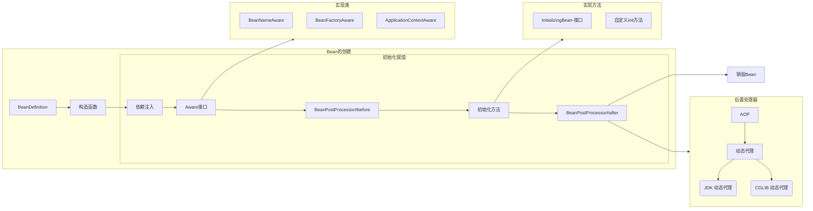

# Spring 开篇

- Spring
  - Spring
    - Bean线程安全问题
    - AOP
      - 事务原理
      - 事务失效
    - Bean的生命周期
    - 循环依赖
  - SpringMVC
    - 执行流程
  - SpringBoot
    - 自动配置原理
- Mybatis
  - 执行流程
  - 延迟加载
  - 一二级缓存

# Spring——单例Bean是线程安全的嘛？

```java
@Service
@Scope("singleton")
public class UserServiceImpl implements UserService{
    
}
```

- singleton: bean在每个Spring IOC容器中只有一个实例
- prototype: 一个bean的定义可以有多个实例

**不是线程安全的**

```java
@Controller
@RequestMapping("/user")
public class UserController {
    // 成员方法需考虑线程安全
    private int count;
    
    @Autowired
    private UserService userService;
    
    @GetMapping("/getById/{id}")
    public User getById(@PathVariable("id") Integer id) {
        count++;
        System.out.println(count);
        return userService.getById(id);
    }
}
```

> ​	userService 是不能被修改的，南那么我们就说它是**无状态**的，无状态的类是没有线程安全问题的
>
> ​	Spring bean并没有可变的状态(比如Service类和DAO类)，所以在某种程度上说Spring的单例bean是线程安全的.

Spring框架中的单例Bean是线程安全的嘛？

> ​	不是线程安全的
>
> ​	Spring框架中有一个@Scope注解，默认的值就是`singleton`，单例的。
>
> ​	因为一般在spring的bean中都是注入无状态的对象，没有线程安全问题，如果在bean中定义了可修改的成员变量，是需要考虑线程安全问题的，可以使用多例或者加锁来解决

# Spring——AOP

> ​	AOP被称为面向切面编程，用于将那些与业务无关，但却对多个对象产生影响的公共行为和逻辑，抽取并封装为一个可重用的模块，这个模块被命名为"切面"（Aspect），减少系统中的重复代码。降低了模块间的耦合度，同事提高了系统的可维护性。

常见的AOP使用场景

- 记录操作日志
- 缓存处理
- Spring中内置的事务处理

## 记录操作日志思路

- 需求：
  - 在接受请求时，需要获取请求的用户名、请求方式、访问地址、模块名称、登录ip、操作时间、记录到数据库中的日志表中


## Spring中内置的事务如何实现的？

> ​	Spring支持**编程式事务管理**和**声明式事务管理**两种方式。
>
> - 编程式事务管理：需使用TransactionTemplate来实现，对代码具有侵入性，项目中很少使用。
> - 声明式事务管理：声明式事务管理建立到AOP之上的。其本质是通过AOP功能，对方法前后进行拦截，将食物处理的功能编织到拦截的方法中，也就是在目标方法开始之前加入一个事务，在执行完目标方法之后根据执行情况提交或者回滚事务。

# Spring——事务失效的场景

- 异常捕获处理
  - 原因：事务通知只有捉到了目标抛出的异常，才能进行后续的回滚处理，如果目标自己处理掉异常，事务通知无法知悉
  - 解决：在catch块添加throw new RuntimeException(e)抛出
- 抛出检查异常
  - 原因：Spring 默认只会回滚非检查异常
  - 解决：配置`rollbackFor`属性`@Transactional(rollbackFor=Exception.class)`
- 非public方法
  - 原因：Spring为方法创建代理，添加事务通知、前提条件都是该方法时public的
  - 解决：改为 public 方法

# Spring——bean的生命周期

> 可以了解到
>
> - Spring 容器是如何管理和创建bean实例
> - 方便调试和解决问题

## BeanDefinition

> ​	Spring 容器在进行实例化时，会将 xml 配置的<bean>的信息封装成一个`BeanDefinition`对象, Spring 根据`BeanDefinition`来创建 Bean 对象，里面有很多的属性用来描述 Bean
>
> - beanClassName: bean的类名
> - initMethodName: 初始化方法名称
> - properryValues: bean 的属性值
> - scope: 作用域
> - lazyInit: 延迟初始化




1. 通过`BeanDefinition`获取bean的定义信息
2. 调用`构造函数`实例化bean
3. bean 的依赖注入
4. 处理Aware接口（BeanNameAware、BeanFactoryAware、
   ApplicationContextAware）
5. Bean的后置处理器`BeanPostProcessor-前置`
6. 初始化方法（`InitializingBean`、`init-method`）
7. Bean的后置处理器`BeanPostProcessor-后置`
8. 销毁bean

# Spring——Bean的循环依赖（循环引用）


## 什么是Spring的循环依赖


## 三级缓存解决循环依赖

Spring解决循环依赖是通过三级缓存，对应的三级缓存如下：

```java
// 单实例对象注册器
public class DefaultSingletonBeanRegistry extends SimpleAliasRegistry implements SingletonBeanRegistry {
    private static final int SUPPRESSED_EXCEPTION_LIMIT = 100;
    private final Map<String, Object> singletonObjects = new ConcurrentHashMap(256); // 一级缓存
 	private final Map<String, ObjectFactory<?>> singletonFactories = new HashMap(16); // 三级缓存
    private final Map<String, Object> earlySingletonObjects = new ConcurrentHashMap(16); // 二级缓存
}
```

| 缓存名称 |       源码名称        | 作用                                                         |
| :------: | :-------------------: | ------------------------------------------------------------ |
| 一级缓存 |   singletonObjects    | 单例池，缓存已经经历了完整的生命周期，已经初始化完成的bean对象 |
| 二级缓存 | earlySingletonObjects | 缓存早期的bean对象（生命周期还没走完）                       |
| 三级缓存 |  singletonFactories   | 缓存的是objectFactory，表示对象工厂，用来创建某个对象的      |

一级缓存作用：限制bean在beanFactory只存一份，即实现`singleton scope`,解决不了循环依赖

如果要想打破循环依赖，就需要一个中间人的参与，这个中间人就是二级缓存

 

但是此时只能解决一般对象的循环依赖，不能解决代理对象的循环依赖，此时就需要三级缓存解决缓存依赖


可是，有些循环引用Spring三级缓存还是解决不了，比如构造方法出现了循环依赖...


#  SpringMVC的执行流程

- 视图阶段(老旧JSP等)


- 前后端分离阶段(接口开发、异步)


# SpringBoot——自动配置原理

`@SpringBootApplication`:

- `@SpringBootConfiguration`：该注解与@Configuration注解作用相同，用来声明当前也是一个配置类。
- `@ComponentScan`：组件扫描，默认扫描当前引导类所在包及其子包，
- `@EnableAutoConfiguration`：SpringBoot实现自动化配置的核心注解。

`@EnableAutoConfiguration`:

```java
@Target({ElementType.TYPE})
@Retention(RetentionPolicy.RUNTIME)
@Documented
@Inherited
@AutoConfigurationPackage
@Import({AutoConfigurationImportSelector.class})
public @interface EnableAutoConfiguration {
    ...
}
```

1. 在SpringBoot项目中的引导类上有一个注解@SpringBootApplication，这个注解是对三个注解进行了封装，分别是：
   - `@SpringBootConfiguration`
   - `@EnableAutoConfiguration`
   - `@ComponentScan`
2. 其中`@EnableAutoConfiguration`是实现自动化配置的核心注解。该注解通过`@Import`注解导入对应的配置选择器。内部就是读取了该项目和该项目引用的Jar包的的classpath路径下`META-INF/spring.factories`文件中的所配置的类的全类名。在这些配置类中所定义的Bean会根据条件注解`所指定的条件来决定`是否需要将其导入到Spring容器中。
3. 条件判断会有像`@ConditionalOnClass`这样的注解，判断是否有对应的class文件，如果有则加载该类，把这个配置类的所有的Bean放入Spring容器中使用。

# Spring框架常见的注解

## Spring常见的注解

|                      注解                      | 说明                                                         |
| :--------------------------------------------: | ------------------------------------------------------------ |
| @Component、@Controller、@Service、@Repository | 使用在类上用于实例化Bean                                     |
|                   @Autowired                   | 使用在字段上用于根据类型依赖注入                             |
|                   @Qualifier                   | 结合@Autowired一起使用用于根据名称进行依赖注入               |
|                     @Scope                     | 标注Bean的作用范围                                           |
|                 @Configuration                 | 指定当前类是一个Spring配置类，当创建容器时会从该类上加载注解 |
|                 @ComponentScan                 | 用于指定Spring在初始化容器时要扫描的包                       |
|                     @Bean                      | 使用在方法上，标注将该方法的返回值存储在Spring容器中         |
|                    @Import                     | 使用@Import导入的类会被Spring加载到IOC容器中                 |
|  @Aspet、@Before、@After、@Around、@Pointcut   | 用于切面编程                                                 |

> 高频面试题：
>
> 1. Spring和SpringBoot之间有什么区别？
> 2. 请你描述一下Spring的DI和IOC
> 3. JDK动态代理和CGLIB动态代理有什么区别？
> 4. 拦截器和过滤器有什么区别

## SpringMVC常见的注解

|      注解       | 说明                                                         |
| :-------------: | ------------------------------------------------------------ |
| @RequestMapping | 用于映射请求路径、可以定义在类上和方法上。用于类上，则表示类中的所有方法都是以该地址作为父路径 |
|  @RequestBody   | 注解实现接受http请求的json数据，将json数据转换为java对象     |
|  @RequestParam  | 指定请求参数的名称                                           |
|  @PathViriable  | 从请求路径下中获取请求参数(/user/{id})，传递给方法的形式参数 |
|  @ResponseBody  | 注解实现将controller方法返回对象转换为json对象响应给客户端   |
| @RequestHeader  | 获取指定的请求头数据                                         |
| @RestController | @Controller + @ResponseBody                                  |

## SpringBoot常见的注解

|           注解           | 说明                                         |
| :----------------------: | -------------------------------------------- |
| @SpringBootConfiguration | 组合了@Configuration注解，实现配置文件的功能 |
| @EnableAutoConfiguration | 打开自动配置的功能, 也可以关闭某个自动配置   |
|      @ComponentScan      | Spring组件扫描                               |

# Mybatis——执行流程

1. `mybatis-config.xml`
2. 构建会话工厂-SqlSessionFactory
   - 会话工厂，全局一个，生产sqlSession
3. 创建会话-SqlSession
   - 项目与数据库的会话，包含了执行sql语句的所有方法，每次操作一个会话，有多个
4. `Executor`执行器
   - 真正执行数据库操作接口，也负责查询缓存的维护
5. `MappedStatement`对象
   - 输入参数（map、list、string、integer、pojo）
   - 输出结果(map、list、string、integer、pojo)
6. 数据库


# Mybatis——是否支持延迟加载

> ​	Mybatis 支持延迟加载，但默认没有开启
>
> ​	查询用户的时候，把用户所属的订单数据也查询出来，这个是立即加载
>
> ​	查询用户的时候，暂时不查询订单数据，当需要订单的时候，在查询订单，这个就是延迟加载。
>
> ​	延迟加载的意思是：就是在需要用到数据时才进行加载，不需要用到数据时就不加载数据。
>
> ​	Mybatis支持一对一关联对象和一对多关联集合对象的延迟加载
>
> ​	在Mybatis配置文件中，可以配置是否启用延迟加载`lazyLoadingEnabled=true|false`，默认是关闭的

## 延迟加载的原理

1. 使用CGLIB创建目标对象的代理对象
2. 当调用目标方法user.getOrderList()时，进入拦截器invoke方法，发现user.getOrderList()是null值，执行sql查询order列表
3. 把order查询上来，然后调用user.setOrderList(List<Order> orderList)，接着完成user.getOrderList()方法的调用


# Mybatis—— 一、二级缓存

> - 本地缓存，基于`PerpetualCache`，本质是一个`HashMap`
> - 一级缓存：作用域是`session`级别
> - 二级缓存：作用域是`namespace`和`mapper`的作用域，不依赖于`session`

## 一级缓存

> ​	基于`PerpetualCache`的`HashMap`本地缓存，其存储作用域为`Session`，当`Session`进行`flush`或`close`之后，该`Session`中的所有`Cache`就将清空，**默认打开一级缓存**

## 二级缓存

> ​	是基于`namespace`和`mapper`的作用域起作用的，不是依赖于`Sqlsession`，默认也是采用`PerpetualCache`，`HashMap`存储

- 二级缓存默认是关闭的

- 开启方式

  1. 全局配置文件

  ```xml
  <settings>
  	<setting name="cacheEnabled" value="true"/> 
  </settings>
  ```

  2. 映射文件：使用`<cache/>`标签让当前`mapper`生效二级缓存

- 注意事项

  1. 对于缓存数据更新机制，当某一个作用域（一级缓存Session/二级缓存Namespaces)的进行了新增、修改、删除操作后，默认该作用域下所有select中的缓存将被clear
  2. 二级缓存需要缓存的数据实现Serializable接口
  3. 只有会话提交或者关闭以后，一级缓存中的数据才会转移到二级缓存中