```mermaid
%% 发送短信验证码
graph LR
A((开始)) --> B[提交手机号];
B --> C{校验手机号} --> |不符合|B
C --> |符合|D[生成验证码] --> E[保存验证码到Session] --> F[发送验证码] --> G((结束))
```

```mermaid
%% 发送短信验证码
graph LR
A((开始)) --> B[提交手机号和验证码];
B --> C{校验验证码} --> |不一致|B
C --> |一致|D[根据手机号查询用户] --> E[用户是否存在] --> |不存在|F[创建新用户] --> G[保存用户到数据库] --> H
E --> |存在|H[保存用户到Session] --> I((结束))
```

```mermaid
graph LR
A((开始)) --> B[请求并携带cookie] --> C[从session获取用户] --> D{判断用户是否存在} --> |存在|E[保存用户到ThreadLocal]
D --> |不存在|F[拦截] --> G((结束))
```

```mermaid
%% 发送短信验证码
graph LR
A((开始)) --> B[提交手机号和验证码];
B --> C{校验验证码} --> |不一致|B
C --> |一致|D[根据手机号查询用户] --> E[用户是否存在] --> |不存在|F[创建新用户] --> G[保存用户到数据库] --> H
E --> |存在|H[保存用户到Redis] --> I[返回token到客户端] --> J((结束))
```

```mermaid
graph TB
A((开始)) --> B[提交店铺id] --> C[从Redis中查询商铺缓存] --> D{{判断缓存是否命中}} --> |命中|E[返回数据] -->Z((结束))
D --> |未命中|F[尝试获取互斥锁] --> G{{判断是否获取锁}} --> |是|H[根据id查询数据库] --> I[将店铺数据写入Redis]-->J[释放互斥锁] --> E
G --> |否|K[休眠一段时间] --> C
```

```mermaid
graph TB

A((开始)) --> B[提交店铺id] --> C[从Redis中查询店铺id] --> D{{判断缓存是否命中}} -->  |未命中|F[返回空] --> G((结束))
D --> |命中|E{{判断缓存是否过期}}
E --> |未过期|H[返回店铺信息] --> G
E --> |过期|I[尝试获取互斥锁] --> J{{判断是否获取锁}} 
J --> |否|H
J --> |是|K[开启独立线程执行缓存重建] -.-> database[根据id查询数据库] --> write[将商铺数据写入Redis,并设置辑过期时间]
```

# 黑马点评

## 1.短信登录

---

### 👌数据库构建

导入准备好的 [hmdp.sql](hmdp.sql) 文件，内容如下

| 表名             | 描述                       |
| :--------------- | :------------------------- |
| tb_user          | 用户表                     |
| tb_user_info     | 用户详情表                 |
| tb_shop          | 商户信息表                 |
| tb_shop_type     | 商户类型表                 |
| tb_blog          | 用户日记表（达人探店日记） |
| tb follow        | 用户关注表                 |
| tb voucher       | 优惠券表                   |
| tb_voucher order | 优惠券的订单表             |

---

### 👌整体架构


---

### 👌导入后端项目

修改相应配置后，启动项目浏览器访问http://localhost:8081/shop-type/list 出现数据则没有问题

---

### 👌导入前端项目

提供的资料中`nginx`目录部署我们需要的前端页面

**运行前端项目**

在`nginx`所在目录下打开一个CMD窗口，输入命令：

```shell
start nginx.exe
```

浏览器打开手机端开发者工具


---

### 👌基于Session实现登录

---

#### 发送验证码功能

**流程图**



```java
@Override
public Result sendCode(String phone, HttpSession session) {
    //1,校验手机号
    if (RegexUtils.isPhoneInvalid(phone)) {
        //2,如果不符合，返回错误信息
        return Result.fail("手机号格式错误");
    }
    //3,符合，生成验证码
    String code = RandomUtil.randomNumbers(6);
    //4,保存验证码到session
    session.setAttribute("code",code);
    //5.发送验证码
    log.debug("发送短信验证码成功，验证码：{}",code);
    return Result.ok(code);
}
```

---

#### 短信验证码登录和注册功能

**流程图**



---

```java
@Override
public Result login(LoginFormDTO loginForm, HttpSession session) {
    //1.校验手机号
    String phone = loginForm.getPhone();
    if (session.getAttribute(phone) == null) {
        //2,如果不符合，返回错误信息
        return Result.fail("手机号格式错误");
    }
    //2.校验验证码
    String cacheCode = loginForm.getCode();
    if (cacheCode == null || !session.getAttribute(phone).equals(cacheCode)) {
        //3.不一致，报错
        return Result.fail("验证码错误");
    }
    //4.一致，根据手机号查询用户
    User user = this.query().eq("phone", phone).one();
    //5.判断用户是否存在
    if (user == null) {
        //6.不存在，创建新用户并保存
        user = saveUserWithPhone(phone);
    }
    //7.保存用户信息孙session中
    session.setAttribute("user",user);

    return Result.ok();
}
// 保存用户方法
private User saveUserWithPhone(String phone) {
    //1.创建用户
    User user = new User();
    user.setPhone(phone);
    user.setNickName(USER_NICK_NAME_PREFIX+RandomUtil.randomString(10));
    //2.保存用户
    this.save(user);
    return user;
}
```

---

#### 登录验证 / 隐藏用户敏感信息

**流程图**



---

```java
/**
 * 登录拦截器
 */
public class LoginInterceptor implements HandlerInterceptor {

/**
 * 前置拦截器
 */
@Override
public boolean preHandle(HttpServletRequest request, HttpServletResponse response, Object handler) throws Exception {
    //1.获取session
    HttpSession session = request.getSession();
    //2.获取session中的用户
    Object user = session.getAttribute("user");
    //3.判断用户是否存在
    if (user == null) {
        //4.不存在，拦截 401 状态码 未授权
        response.setStatus(401);
        return false;
    }
    //5.存在，保存用户信息到ThreadLocal
    UserHolder.saveUser((UserDTO) user);
    //6.放行
    return true;
}
```

```java
package com.hmdp.utils;

import com.hmdp.dto.UserDTO;
import com.hmdp.entity.User;

/**
 *  ThreadLocal类
 */
public class UserHolder {
    private static final ThreadLocal<UserDTO> tl = new ThreadLocal<>();

    public static void saveUser(UserDTO user){
        tl.set(user);
    }

    public static UserDTO getUser(){
        return tl.get();
    }

    public static void removeUser(){
        tl.remove();
    }
}
\
```

> **ThreadLocal**
>
> `ThreadLocal` 是 Java 中的一个类，它提供了线程局部变量。这些变量与它们的普通副本不同，因为每个访问它们（通过 get 或 set 方法）的线程都拥有自己独立初始化的变量副本 1。
>
> 简单来说，我们可以想象 `ThreadLocal` 将数据存储在一个以线程为键的映射中。因此，当我们在 `threadLocalValue` 上调用 get 方法时，我们将获得请求线程的 Integer 值
> 例如，假设我们想要拥有一个与特定线程捆绑的 Integer 值：
>
> ```java
> ThreadLocal<Integer> threadLocalValue = new ThreadLocal<>();
> ```
>
> 接下来，当我们想要从线程中使用这个值时，我们只需要调用 get 或 set 方法。例如：
>
> ```java
> threadLocalValue.set(1);
> Integer result = threadLocalValue.get();
> ```

> # **记得给配置类加上注解**

---

#### 集群的session共享问题

`session共享问题`：多台Tomcat并不共享session存储空间，当请求切换到不同tomcat服务时导致数据丢失的问题。

---

### 👌基于Redis实现共享session登录

#### 发送验证码

```mermaid
%% 发送短信验证码
graph LR
A((开始)) --> B[提交手机号];
B --> C{校验手机号} --> |不符合|B
C --> |符合|D[生成验证码] --> E[保存验证码到Redis] --> F[发送验证码] --> G((结束))
```



```java
@Resource
private StringRedisTemplate stringRedisTemplate;

@Override
public Result sendCode(String phone, HttpSession session) {
    //1,校验手机号
    if (RegexUtils.isPhoneInvalid(phone)) {
        //2,如果不符合，返回错误信息
        return Result.fail("手机号格式错误");
    }
    //3,符合，生成验证码
    String code = RandomUtil.randomNumbers(6);
    //4,保存验证码到Redis //set key value ex 120  秒为单位
    stringRedisTemplate.opsForValue().set(LOGIN_CODE_KEY + phone,code,LOGIN_CODE_TTL, TimeUnit.MINUTES);
    session.setAttribute("code",code);
    //5.发送验证码
    log.debug("发送短信验证码成功，验证码：{}",code);
    return Result.ok(code);
}
```


---

#### 短信验证码登录和注册功能



```java
@Override
public Result login(LoginFormDTO loginForm, HttpSession session) {
    //1.校验手机号
    String phone = loginForm.getPhone();
    if (RegexUtils.isPhoneInvalid(phone)) {
        //2,如果不符合，返回错误信息
        return Result.fail("手机号格式错误");
    }
    //2.从Redis获取校验验证码
    String cacheCode = stringRedisTemplate.opsForValue().get(LOGIN_CODE_KEY + phone);
    String code = loginForm.getCode();
    if (cacheCode == null || !cacheCode.equals(code)) {
        //3.不一致，报错
        return Result.fail("验证码错误");
    }
    //4.一致，根据手机号查询用户
    User user = this.query().eq("phone", phone).one();
    //5.判断用户是否存在
    if (user == null) {
        //6.不存在，创建新用户并保存
        user = saveUserWithPhone(phone);
    }
    // 7.保存用户信息Redis中
    // 7.1 随机生成Token作为登录令牌
    String token = UUID.randomUUID().toString(true);
    // 7.2 将User对象转为Hash存储
    UserDTO userDTO = BeanUtil.copyProperties(user, UserDTO.class);
    Map<String, Object> userMap = BeanUtil.beanToMap(userDTO);
    // 7.3 存储
    stringRedisTemplate.opsForHash().putAll(LOGIN_USER_KEY + token, userMap);
    // 7.4 设置过期时间
    stringRedisTemplate.expire(LOGIN_USER_KEY + token, CACHE_SHOP_TTL, TimeUnit.MINUTES);
    // 8 返回Token
    return Result.ok(token);
}
```

---

#### 登录验证

```mermaid
graph LR
A((开始)) --> B[请求并携带Token] --> C[从Redis获取用户] --> D{判断用户是否存在} --> |存在|E[保存用户到ThreadLocal]
D --> |不存在|F[拦截] --> G((结束))
```



```java
/**
 * 前置拦截器
 */
@Override
public boolean preHandle(HttpServletRequest request, HttpServletResponse response, Object handler) throws Exception {
    //1.获取请求头中的Token
    String token = request.getHeader("authorization");
    if (StrUtil.isBlank(token)) {
        response.setStatus(401);
        return false;
    }
    //2.获取Redis中的用户
    Map<Object, Object> userMap = stringRedisTemplate.opsForHash().entries(RedisConstants.LOGIN_USER_KEY + token);
    //3.判断用户是否存在
    if (userMap.isEmpty()) {
        //4.不存在，拦截 401 状态码 未授权
        response.setStatus(401);
        return false;
    }
    // 5.将查询的Hash数据转为UserDTO对象
    UserDTO userDTO = BeanUtil.fillBeanWithMap(userMap, new UserDTO(), false);
    // 6.存在，保存用户信息到ThreadLocal
    UserHolder.saveUser(userDTO);
    // 7.刷新Token有效期
    stringRedisTemplate.expire(LOGIN_USER_KEY + token, CACHE_SHOP_TTL, TimeUnit.MINUTES);
    // 8.放行
    return true;
}
```

> ## Result类中不要在添加返回Msg构造方法

---

#### 登录拦截器的优化


---

## 2.商户查询缓存

### 💥什么是缓存

`缓存:`就是数据交换的缓冲区（称作Cache),是存贮数据的临时地方，一般读写性能较高。


---

### 👌添加Redis缓存

**流程图**


```java
@Override
public Result queryById(Long id) {
    // 1.从Redis查询商铺信息
    String shopJson = stringRedisTemplate.opsForValue().get(CACHE_SHOP_KEY + id);
    // 2.判断是否存在
    if (StrUtil.isNotBlank(shopJson)){
        // 3.存在，直接返回
        Shop shop = JSONUtil.toBean(shopJson, Shop.class);
        return Result.ok(shop);
    }
    // 4.不存在，根据id查询数据库
    Shop shop = this.getById(id);
    // 5.返回错误
    if (shop == null) {
        return Result.fail("店铺不存在");
    }
    // 6.存在，写入Redis
    stringRedisTemplate.opsForValue().set(CACHE_SHOP_KEY + id, JSONUtil.toJsonStr(shop));
    // 7.返回
    return Result.ok(shop);
}
```

---

#### 练习:给店铺类型查询业务添加缓存

```java
@Resource
private StringRedisTemplate stringRedisTemplate;

@Override
public Result queryTypeList() {
    // 1.从Redis中查询数据
    List<String> jsonShopTypes = stringRedisTemplate.opsForList().range(CACHE_TYPES_KEY, 0, -1);
    // 2.有数据直接返回
    if (!CollectionUtil.isEmpty(jsonShopTypes)) {
        //缓存命中 JSON化List返回
        List<ShopType> shopList = jsonShopTypes.stream()
                .map(item -> JSONUtil.toBean(item, ShopType.class))
                .sorted(Comparator.comparing(ShopType::getSort))
                .collect(Collectors.toList());
        return Result.ok(shopList);
    }
    // 3.shopList
    List<ShopType> shopList = this.query().orderByAsc("sort").list();
    // 4.数据库无数据返回
    if (CollectionUtil.isEmpty(shopList)) {
        //Collections.emptyList().toString() 返回一个可序列化的空集合
//            stringRedisTemplate.opsForValue()
//                    .set(CACHE_TYPES_KEY, Collections.emptyList().toString(), CACHE_NULL_TTL, TimeUnit.MINUTES);
        return Result.fail("无店铺类型");
    }
    // 5.有数据写入Redis中再返回
    List<String> shopTypeCache = shopList.stream()
            .sorted(Comparator.comparing(ShopType::getSort))
            .map(JSONUtil::toJsonStr)
            .collect(Collectors.toList());
    stringRedisTemplate.opsForList().rightPushAll(CACHE_TYPES_KEY,shopTypeCache);
    stringRedisTemplate.expire(CACHE_TYPES_KEY,CACHE_NULL_TTL,TimeUnit.MINUTES);

    return Result.ok(shopList);
}
```

---

### 💥缓存更新策略

| 种类     |                           内存淘汰                           |                           超时剔除                           |                     主动更新                      |
| -------- | :----------------------------------------------------------: | :----------------------------------------------------------: | :-----------------------------------------------: |
| 说明     | 不用自己维护，利用`Redis`的内存淘汰机制，<br>当内存不足时自动淘汰部分数据。下次查询时更新缓存。 | 给缓存数据添加TTL时间，到期后自<br/>动删除缓存。下次查询时更新缓存。 | 编写业务逻辑，在修改数据库的<br/>同时，更新缓存。 |
| 一致性   |                              差                              |                             一般                             |                        好                         |
| 维护成本 |                              无                              |                              低                              |                        高                         |

> 业务场景：
>
> * 低一致性需求：使用内存淘汰机制。例如店铺类型的查询缓存
> * 高一致性需求：主动更新，并以超时剔除作为兜底方案。例如店铺详情查询的缓存

---

**主动更新策略**

💥**三种解决方案**


💥操作缓存和数据库时有三个问题需要考虑：

1. 删除缓存还是更新缓存？

* 更新缓存：每次更新数据库都更新缓存，无效写操作较多。❌
* 删除缓存：更新数据库时让缓存失效，查询时再更新缓存。✔

2. 如何保证缓存与数据库的操作的同时成功或失败？

* 单体系统，将缓存与数据库操作放在一个事务
* 分布式系统，利用TCC等分布式事务方案

---

3. 先操作缓存还是先操作数据库？

* 先删除缓存，再操作数据库
* 先操作数据库，再删除缓存


> 两种方案出现不一致性的安全问题
>
> `方案二`发生概率低于`方案一`

---

#### 总结

> 缓存更新策略的最佳实践方案：
> 1.低一致性需求：使用`Redis`自带的内存淘汰机制
> 2.高一致性需求：主动更新，并以超时剔除作为兜底方案
>
> #### 	◆读操作：
>
> ##### 			缓存命中则直接返回
>
> ##### 			缓存未命中则查询数据库，并写入缓存，设定超时时间
>
> #### ◆写操作：
>
> ##### 			先写数据库，然后再删除缓存
>
> ##### 			要确保数据库与缓存操作的原子性

---

#### 案例

**给查询商铺的缓存添加超时剔除和主动更新的策略**
修改`ShopController`中的业务逻辑，满足下面的需求：
	①根据`id`查询店铺时，如果缓存未命中，则查询数据库，将数据库结果写入缓存，并设置超时时间

```java
// 6.存在，写入Redis添加过期时间
stringRedisTemplate.opsForValue().set(CACHE_SHOP_KEY + id, JSONUtil.toJsonStr(shop),CACHE_SHOP_TTL, TimeUnit.MINUTES);
```

​	②根据`id`修改店铺时，先修改数据库，再删除缓存

```java
@Override
@Transactional
public Result update(Shop shop) {
    Long id = shop.getId();
    if (id == null) {
        return Result.fail("店铺id不能为空");
    }
    // 1.更新数据库
    this.updateById(shop);
    // 2.删除缓存
    stringRedisTemplate.delete(CACHE_SHOP_KEY + id);
    return Result.ok();
}
```

---

### 👌缓存穿透

`缓存穿透`是指客户端请求的数据在缓存中和数据库中都不存在，这样缓存永远不会生效，这些请求都会打到数据库。

> 如果别有用心的访问一个缓存中不存在的数据，则会直接请求数据库，大量请求下可能会导致数据库崩溃

**解决方法：**

* 缓存空对象

```java
当第一次访问缓存不存在的数据后，缓存一个空对象，这样下一次访问时则返回缓存中的空对象
    
优点：实现简单，维护方便
缺点：
	1.额外的内存消耗
	2.可能造成短期的不一致
```


* 布隆过滤器

```java
当一个元素被加入布隆过滤器中的时候，会进行如下操作：使用布隆过滤器中的哈希函数对元素值进行计算，得到哈希值（有几个哈希函数得到几个哈希值）。根据得到的哈希值，在位数组中把对应下标的值置为1。

当我们需要判断一个元素是否存在于布隆过滤器的时候，会进行如下操作：对给定元素再次进行相同的哈希计算；得到值之后判断位数组中的每个元素是否都为 1，如果值都为 1，那么说明这个值在布隆过滤器中，如果存在一个值不为 1，说明该元素不在布隆过滤器中。

优点：内存占用较少，没有多余Key
缺点：
    1.实现复杂
    2.存在误判可能
```

---

**流程**


缓存空对象实现

```java
@Override
public Result queryById(Long id) {
    // 1.从Redis查询商铺信息
    String shopJson = stringRedisTemplate.opsForValue().get(CACHE_SHOP_KEY + id);
    // 2.判断是否存在
    if (StrUtil.isNotBlank(shopJson)){
        // 3.存在，直接返回
        Shop shop = JSONUtil.toBean(shopJson, Shop.class);
        return Result.ok(shop);
    }
    if (shopJson != null){
        return Result.fail("店铺不存在");
    }
    // 4.不存在，根据id查询数据库
    Shop shop = this.getById(id);
    // 5.返回错误
    if (shop == null) {
        //将空值写入Redis
        stringRedisTemplate.opsForValue().set(CACHE_SHOP_KEY + id, "",CACHE_NULL_TTL, TimeUnit.MINUTES);
        return Result.fail("店铺不存在");
    }
    // 6.存在，写入Redis
    stringRedisTemplate.opsForValue().set(CACHE_SHOP_KEY + id, JSONUtil.toJsonStr(shop),CACHE_SHOP_TTL, TimeUnit.MINUTES);
    // 7.返回
    return Result.ok(shop);
}
```

---

#### 总结

缓存穿透产生的原因是什么？

* 用户请求的数据在缓存中和数据库中都不存在，不断发起这样的请求，给数据库带来巨大压力

缓存穿透的解决方案有哪些？

* 缓存null值
* 布隆过滤
* 增强`id`的复杂度，避免被猜测`id`规律
* 做好数据的基础格式校验
* 加强用户权限校验
* 做好热点参数的限流

---

### 👌缓存雪崩

`缓存雪崩`是指在同一时段大量的缓存key同时失效或者`Redis`服务宕机，导致大量请求到达数据库，带来巨大压力。

> **解决方案：**
>
> * 给不同的Key的TTL添加随机值
> * 利用`Redis`集群提高服务的可用性
> * 给缓存业务添加降级限流策略
> * 给业务添加多级缓存

---

### 👌缓存击穿

`缓存击穿`问题也叫`热点Key`问题，就是一个被`高并发访问`并且`缓存重建业务较复杂`的key突然失效了，无数的请求访问会
在瞬间给数据库带来巨大的冲击。

> **常见的解决方案有两种：**
>
> * 互斥锁
>
> 
>
> * 逻辑过期
>
> 

**优缺点分析：**

| 解决方案 |                     优点                     |                    缺点                    |
| :------: | :------------------------------------------: | :----------------------------------------: |
|  互斥锁  | 没有额外的内存消耗<br>保证一致性<br>实现简单 | 线程需要等待，性能受影响<br>可能有死锁风险 |
| 逻辑过期 |            线程无需等待，性能较好            | 不保证一致性<br>有额外内存消耗<br>实现复杂 |

---

#### 案例

**基于互斥锁方式解决缓存击穿问题**
需求：修改根据id查询商铺的业务，基于`互斥锁方式`来解决缓存击穿问题

**流程图**



---

```java
/**
* 线程池
*/
private static final ExecutorService CACHE_REBUILD_EXECUTOR = Executors.newFixedThreadPool(10);

/**
* 基于互斥锁解决缓存击穿
* @param id 店铺id
* @return
*/
public Shop queryWithMutex(Long id) {
    // 1.从Redis查询商铺信息
    String shopJson = stringRedisTemplate.opsForValue().get(CACHE_SHOP_KEY + id);
    // 2.判断是否存在(命中)
    if (StrUtil.isNotBlank(shopJson)) {
        // 3.存在，直接返回
        return JSONUtil.toBean(shopJson, Shop.class);
    }
    if (shopJson != null) {
        return null;
    }
    // 4.实现缓存重建
    // 4.1 获取互斥锁
    String lockKey = LOCK_SHOP_KEY + id;
    Shop shop = null;
    try {
        boolean isLock = tryLock(lockKey);
        // 4.2 判断是否获取成功
        if (!isLock) {
            // 4.3 失败，休眠并重试
            Thread.sleep(50);
            return queryWithMutex(id);
        }
        // 4.4 成功，根据id查询数据库
        shop = this.getById(id);
        // 模拟重建延迟
        Thread.sleep(200);
        // 5.返回错误
        if (shop == null) {
            //将空值写入Redis
            stringRedisTemplate.opsForValue().set(CACHE_SHOP_KEY + id, "", CACHE_NULL_TTL, TimeUnit.MINUTES);
            return null;
        }
        // 6.存在，写入Redis
        stringRedisTemplate.opsForValue().set(CACHE_SHOP_KEY + id, JSONUtil.toJsonStr(shop), CACHE_SHOP_TTL, TimeUnit.MINUTES);
    } catch(InterruptedException e){
        throw new RuntimeException(e);
    } finally {
        // 7.释放互斥锁
        unlock(lockKey);
    }
    // 8.返回
    return shop;
}
/**
 * 获取锁
 *
 * @param key 键
 * @return
 */
private boolean tryLock(String key) {
    Boolean flag = stringRedisTemplate.opsForValue().setIfAbsent(key, "1", 10, TimeUnit.SECONDS);
    return BooleanUtil.isTrue(flag);
}

/**
 * 释放锁
 *
 * @param key 键
 */
private void unlock(String key) {
    stringRedisTemplate.delete(key);
}
```

---

**基于逻辑过期方式解决缓存击穿问题**
需求：修改根据id查询商铺的业务，基于`逻辑过期方式`来解决缓存击穿问题

**流程图**



---

```java
private static final ExecutorService CACHE_REBUILD_EXECUTOR = Executors.newFixedThreadPool(10);

/**
 * 基于逻辑过期解决缓存击穿
 * 需要注意的是如果数据一开始未存在于Redis中，则会返回无店铺数据，所有需要执行前缓存预热
 * @param id
 * @return
 */
public Shop queryWithLogicalExpire(Long id) {
    // 1.从Redis查询商铺信息
    String shopJson = stringRedisTemplate.opsForValue().get(CACHE_SHOP_KEY + id);
    // 2.判断是否存在
    if (StrUtil.isBlank(shopJson)) {
        // 3.未命中，直接返回
        return null;
    }
    // 4.命中，需要先将json反序列化为对象
    RedisData redisData = JSONUtil.toBean(shopJson, RedisData.class);
    Shop shop = JSONUtil.toBean((JSONObject) redisData.getData(), Shop.class);
    LocalDateTime expireTime = redisData.getExpireTime();
    // 5.判断缓存是否过期
    if (expireTime.isAfter(LocalDateTime.now())) {
        // 5.1未过期，直接返回店铺信息
        return shop;
    }
    // 5.2已过期，需要缓存重建
    // 6.缓存重建
    // 6.1 获取互斥锁
    String lockKey = LOCK_SHOP_KEY + id;
    boolean isLock = tryLock(lockKey);
    // 6.2 判断是否获取锁成功
    if (isLock) {
        // 6.3 成功,开启独立线程，实现缓存重建
        CACHE_REBUILD_EXECUTOR.submit(() -> {
            try {
                //缓存重建
                this.saveShop2Redis(id, 20L);
            } catch (Exception e) {
                throw new RuntimeException(e);
            } finally {
                unlock(lockKey);
            }
        });
    }
    // 6.4 失败，返回过期店铺信息

    return shop;
}
```

---

### 👌缓存工具封装

> 基于`StringRedisTemplate`封装一个缓存工具类，满足下列需求：
> 方法1：将任意)ava对象序列化为JSON并存储在string类型的key中，并且可以设置TTL过期时间
> 方法2：将任意Java对象序列化为JSON并存储在string类型的key中，并且可以设置逻辑过期时间，用于处理缓存击穿问题
> 方法3：根据指定的key查询缓存，并反序列化为指定类型，利用缓存空值的方式解决缓存穿透问题
> 方法4：根据指定的key查询缓存，并反序列化为指定类型，需要利用逻辑过期解决缓存击穿问题

```java
package com.hmdp.utils;

import cn.hutool.core.util.BooleanUtil;
import cn.hutool.core.util.StrUtil;
import cn.hutool.json.JSONObject;
import cn.hutool.json.JSONUtil;
import com.hmdp.entity.Shop;
import lombok.extern.slf4j.Slf4j;
import org.springframework.data.redis.core.StringRedisTemplate;
import org.springframework.stereotype.Component;

import java.time.LocalDateTime;
import java.util.concurrent.ExecutorService;
import java.util.concurrent.Executors;
import java.util.concurrent.TimeUnit;
import java.util.function.Function;

import static com.hmdp.utils.RedisConstants.*;

/**
 * Redis工具类
 */
@Slf4j
@Component
public class CacheClient {
    private final StringRedisTemplate stringRedisTemplate;

    public CacheClient(StringRedisTemplate stringRedisTemplate) {
        this.stringRedisTemplate = stringRedisTemplate;
    }

    public void set(String key, Object value, Long time, TimeUnit unit){
        stringRedisTemplate.opsForValue().set(key, JSONUtil.toJsonStr(value), time, unit);
    }

    public void setWithLogicExpire(String key, Object value, Long time, TimeUnit unit){
        // 设置逻辑过期
        RedisData redisData = new RedisData();
        redisData.setData(value);
        redisData.setExpireTime(LocalDateTime.now().plusSeconds(unit.toSeconds(time)));
        // 写入Redis
        stringRedisTemplate.opsForValue().set(key, JSONUtil.toJsonStr(redisData));
    }

    /**
     * 缓存穿透
     * @param keyPrefix key前缀
     * @param id 查询id
     * @param type 类型
     * @param dbFallback 数据库查询函数
     * @param time 过期时间
     * @param unit 时间单位
     * @return
     * @param <R> 泛型 1
     * @param <ID> 泛型 2
     */
    public <R, ID> R queryWithPassThrough(
            String keyPrefix, ID id, Class<R> type, Function<ID, R> dbFallback, Long time, TimeUnit unit) {
        String key = keyPrefix + id;
        // 1.从Redis查询商铺信息
        String json = stringRedisTemplate.opsForValue().get(key);
        // 2.判断是否存在
        if (StrUtil.isNotBlank(json)) {
            // 3.存在，直接返回
            return JSONUtil.toBean(json, type);
        }
        if (json != null) {
            return null;
        }
        // 4.不存在，根据id查询数据库
        R r = dbFallback.apply(id);
        // 5.返回错误
        if (r == null) {
            //将空值写入Redis
            stringRedisTemplate.opsForValue().set(CACHE_SHOP_KEY + id, "", CACHE_NULL_TTL, TimeUnit.MINUTES);
            return null;
        }
        // 6.存在，写入Redis
        this.set(key, r, time, unit);
        // 7.返回
        return r;
    }

    /**
     * 线程池
     */
    private static final ExecutorService CACHE_REBUILD_EXECUTOR = Executors.newFixedThreadPool(10);
    public <R, ID> R queryWithLogicalExpire(
            String keyPrefix, ID id, Class<R> type, Function<ID, R> dbFallback, Long time, TimeUnit unit) {
        String key = keyPrefix + id;
        // 1.从Redis查询商铺信息
        String json = stringRedisTemplate.opsForValue().get(key);
        // 2.判断是否存在
        if (StrUtil.isBlank(json)) {
            // 3.未命中，直接返回
            return null;
        }
        // 4.命中，需要先将json反序列化为对象
        RedisData redisData = JSONUtil.toBean(json, RedisData.class);
        R r = JSONUtil.toBean((JSONObject) redisData.getData(), type);
        LocalDateTime expireTime = redisData.getExpireTime();
        // 5.判断缓存是否过期
        if (expireTime.isAfter(LocalDateTime.now())) {
            // 5.1未过期，直接返回店铺信息
            return r;
        }
        // 5.2已过期，需要缓存重建
        // 6.缓存重建
        // 6.1 获取互斥锁
        String lockKey = LOCK_SHOP_KEY + id;
        boolean isLock = tryLock(lockKey);
        // 6.2 判断是否获取锁成功
        if (isLock) {
            // 6.3 成功,开启独立线程，实现缓存重建
            CACHE_REBUILD_EXECUTOR.submit(() -> {
                try {
                    //缓存重建
                    //查询数据库
                    R r1 = dbFallback.apply(id);
                    //写入Redis
                    this.setWithLogicExpire(key, r1, time, unit);
                } catch (Exception e) {
                    throw new RuntimeException(e);
                } finally {
                    unlock(lockKey);
                }
            });
        }
        // 6.4 失败，返回过期店铺信息
        return r;
    }
    /**
     * 获取锁
     *
     * @param key 键
     * @return
     */
    private boolean tryLock(String key) {
        Boolean flag = stringRedisTemplate.opsForValue().setIfAbsent(key, "1", 10, TimeUnit.SECONDS);
        return BooleanUtil.isTrue(flag);
    }

    /**
     * 释放锁
     *
     * @param key 键
     */
    private void unlock(String key) {
        stringRedisTemplate.delete(key);
    }
}
```

---

## 3.优惠券秒杀

### 👌全局唯一ID

每个店铺都可以发布优惠券：

这就导致了当用户抢购时，就会生成订单并保存到`tb_voucher_order`这张表中，而订单表如果使用数据库自增ID就存在一些问题：

* id的规律性太明显
* 受单表数据量的限制

`全局ID生成器`，是一种在分布式系统下用来生成全局唯一D的工具，一般要满足下列特性：

> 1. 唯一性
> 2. 递增性
> 3. 高可用
> 4. 高性能
> 5. 安全性

如何设计？


ID的组成部分：

* 符号位：`1 bit`, 永远为0
* 时间戳：`31 bit`, 以秒为单位，可以使用69年
* 序列号：`32 bit`, 秒内的计数器，支持每秒产生2^32个不同ID

```java
package com.hmdp.utils;

import org.springframework.data.redis.core.RedisTemplate;
import org.springframework.data.redis.core.StringRedisTemplate;
import org.springframework.stereotype.Component;

import java.time.LocalDateTime;
import java.time.ZoneOffset;
import java.time.format.DateTimeFormatter;

/**
 * 全局ID生成器
 */
@Component
public class RedisIdWorker {
    /**
     * 开始时间戳
     */
    private static final long BEGIN_TIMESTAMP = 1640995200L;

    /**
     * 序列号的位数
     */
    public static final int COUNT_BITS = 32;
    private RedisTemplate RedisTemplate;

    public RedisIdWorker(StringRedisTemplate stringRedisTemplate) {
        this.RedisTemplate = stringRedisTemplate;
    }

    /**
     * 获取ID
     * @param keyPrefix 业务前缀
     * @return
     */
    public long nextId(String keyPrefix){
        // 1.生成时间戳
        LocalDateTime now = LocalDateTime.now();
        long nowSecond = now.toEpochSecond(ZoneOffset.UTC);
        long timestamp = nowSecond - BEGIN_TIMESTAMP;
        // 2.生成序列号
        // 2.1 获取当前日期，精确到天
        String date = now.format(DateTimeFormatter.ofPattern("yyyy:MM:dd"));
        Long count = RedisTemplate.opsForValue().increment("icr" + keyPrefix + ":" + date);
        // 3.拼接返回
        return timestamp << COUNT_BITS | count;
    }

    /*
    //获取日期对应的秒数
    LocalDateTime time = LocalDateTime.of(2022, 1, 1, 0, 0, 0);
    long second = time.toEpochSecond(ZoneOffset.UTC);
    System.out.println(second);
    */
}
```

---

全局唯一ID生成策略

* UUID
* `Redis`自增
* snowflake算法
* 数据库自增

`Redis`自增策略

* 每天一个key,方便统计订单量
* ID构造是 时间戳+计数器

---

### 👌实现优惠券秒杀下单

**下单时需要判断两点：**

* 秒杀是否开始或结束，如果尚未开始或已经结束则无法下单
* 库存是否充足，不足则无法下单

```mermaid
graph LR
strat((开始)) --> A[提交优惠券id] --> B[查询优惠券信息] --> C{{判断秒杀是否开启}}
C --> |否|R[返回异常结果] --> last((结束))
C --> |是|D{{判断库存是否充足}}
D --> |否|R
D --> |是|E[扣减库存] --> create[创建订单] --> re[返回订单id] --> last
```



---

```java
@Resource
private ISeckillVoucherService seckillVoucherService;

@Resource
private RedisIdWorker redisIdWorker;
@Override
@Transactional
public Result seckillVoucher(Long voucherId) {
    // 1.查询优惠券
    SeckillVoucher voucher = seckillVoucherService.getById(voucherId);
    // 2.判断秒杀是否开启
    if (voucher.getBeginTime().isAfter(LocalDateTime.now())) {
        //尚未开始
        return Result.fail("秒杀尚未开始");
    }
    // 3.判断秒杀是否结束
    if (voucher.getEndTime().isBefore(LocalDateTime.now())) {
        //已经结束
        return Result.fail("秒杀已经结束");
    }
    // 4.判断库存是否充足
    if (voucher.getStock() < 1) {
        //库存不足
        return Result.fail("库存不足");
    }
    // 5.扣减库存
    boolean success = seckillVoucherService.update().setSql("stock = stock - 1").eq("voucher_id", voucherId).update();
    if (!success){
        // 扣减失败
        return Result.fail("库存不足");
    }
    // 6.创建订单
    VoucherOrder voucherOrder = new VoucherOrder();
    // 6.1 订单id
    long orderId = redisIdWorker.nextId("order");
    voucherOrder.setId(orderId);
    // 6.2 用户id
    Long userId = UserHolder.getUser().getId();
    voucherOrder.setUserId(userId);
    // 6.3 代金券id
    voucherOrder.setVoucherId(voucherId);
    this.save(voucherOrder);
    // 7.返回订单id
    return Result.ok(orderId);
}
```

---

### 👌超卖问题

`超卖问题`是典型的多线程安全问题，针对这一问题的常见解决方案就是加锁：


**乐观锁常用的两种方式：**

* 版本号法

> 添加`version`字段,修改时携带`version`并判断版本号是否改变

* CAS法（`CompareAndSet`）

  > 修改时直接携带`stock`并判断数量是否正确
  >
  > ```java
  > // 5.扣减库存时再判断一次库存是否充足
  > boolean success = seckillVoucherService.update()
  >         .setSql("stock = stock - 1")
  >         .eq("voucher_id", voucherId)
  >         .gt("stock",0)
  >         .update();
  > ```

---

1. 悲观锁：添加同步锁，让线程串行执行
   * 优点：简单粗暴
   * 缺点：性能一般
2. 乐观锁：不加锁，在更新时判断是否有其它线程在修改
   * 优点：性能好
   * 缺点：存在成功率低的问题

---

### 👌一人一单

需求：修改秒杀业务，要求同一个优惠券，一个用户只能下一单

```mermaid
graph LR
strat((开始)) --> submit(提交优惠券id) --> query(查询优惠券信息) --> 判断1{{判断秒杀是否开启}}

判断1 --> |是|判断2{{判断库存是否充足}}
判断1 --> |否|return(返回异常结果) --> last((结束))

判断2 --> |是|query2(根据优惠券id和用户id查询订单) --> 判断3(判断订单是否存在)
判断2 --> |否|return

判断3 --> |不存在|扣减(扣减库存) --> create(创建订单) --> a(返回订单id) --> last((结束))
判断3 --> |存在|return

```

> 知识点随记：`spring框架事务失效`、`aop代理对象`、`synchronized锁对象`。

```java
// 5.一人一单
...
{   
    ...
	Long userId = UserHolder.getUser().getId();
    // 对用户ID加锁
	synchronized(userId.toString().intern()){
    	// 获取代理对象（事务）
	    IVoucherOrderService proxy = (IVoucherOrderService) AopContext.currentProxy();
    	return proxy.createVoucherOrder(voucherId);
	}
}

@Transactional
public Result createVoucherOrder(Long voucherId) {
    // 5.一人一单
    Long userId = UserHolder.getUser().getId();
    // 5.1 查询订单
    int count = query().eq("user_id", userId).eq("voucher_id", voucherId).count();
    // 5.2 判断是否存在
    if (count > 0) {
        // 用户已购买
        return Result.fail("用户已经购买过一次");
    }
    // 6.扣减库存
    boolean success = seckillVoucherService.update()
            .setSql("stock = stock - 1")
            .eq("voucher_id", voucherId)
            .gt("stock", 0)
            .update();
    if (!success) {
        // 扣减失败
        return Result.fail("库存不足");
    }
    // 7.创建订单
    VoucherOrder voucherOrder = new VoucherOrder();
    // 7.1 订单id
    long orderId = redisIdWorker.nextId("order");
    voucherOrder.setId(orderId);
    // 7.2 用户id
    voucherOrder.setUserId(userId);
    // 7.3 代金券id
    voucherOrder.setVoucherId(voucherId);
    this.save(voucherOrder);
    // 8.返回订单id
    return Result.ok(orderId);
}
```

---

**一人一单的并发安全问题**

通过加锁可以解决在单机情况下的一人一单安全问题，但是在集群模式下就不行了

1. 我们将服务启动两份，端口分别为8081和8082：


2. 然后修改nginx的conf目录下的nginx.conf文件，配置反向代理和负载均衡：


现在，用户请求会在这两个节点上负载均衡，再次测试下是否存在线程安全问题。

图形演示：


---

### 👌分布式锁

**什么是分布式锁**
**分布式锁**：满足分布式系统或集群模式下多进程可见并且互斥的锁。

分布式锁的核心是实现多进程之间互斥，而满足这一点的方式有很多，常见的有三种：

|        |           MySQL           |          `Redis`          |            Zookeeper             |
| :----: | :-----------------------: | :-----------------------: | :------------------------------: |
|  互斥  | 利用MySQL本身的互斥锁机制 | 利用`setnx`这样的互斥命令 | 利用节点的唯一性和有序性实现互斥 |
| 高可用 |            好             |            好             |                好                |
| 高性能 |           一般            |            好             |               一般               |
| 安全性 |   断开连接，自动释放锁    | 利用锁超时时间，到期释放  |    临时节点，断开连接自动释放    |

---

**基于`Redis`的分布式锁**

实现分布式锁时需要实现的两个基本方法：

* 获取锁：

  * 互斥：确保只能有一个线程获取锁

    ```shell
    # 添加锁，利用setnx的互斥特性
    SFTNX lock thread1
    ```

* 释放锁：

  * 手动释放

  * 超市释放：获取锁时添加一个超时时间
    ```shell
    # 释放锁，删除即可
    DEL key
    
    #添加锁，NX是互斥、EX是设置超时时间
    SET lock thread1 EX 10 NX
    ```

---

流程图

```mermaid
%%{init: {'theme':'neutral'}}%%
flowchart LR
strat((开始)) --> get(尝试获取锁) --> 判断{判断结果} --> |nil|fail(获取锁失败)
	subgraph 获取锁
	 success(获取锁成功) --> to(执行业务) 
	end
	判断 --> |ok|获取锁 --> |业务超时或服务宕机时|自动(自动释放锁)
	to --> 释放锁(释放锁)
```

---

**案例 基于`Redis`实现分布式锁初级版本**
需求：定义一个类，实现下面接口，利用`Redis`实现分布式锁功能。

```java
public interface ILock
    /**
    * 尝试获取锁
    * @param timeoutSec锁持有的超时时间，过期后自动释放
    * @return true代表获取锁成功；false代表获取锁失败
    ★*/
    boolean tryLock(long timeoutSec);
    /**
    * 释放锁
    **/
    void unlock();
}
```

```java
package com.hmdp.utils;

import org.springframework.data.redis.core.StringRedisTemplate;

import javax.annotation.Resource;
import java.util.concurrent.TimeUnit;

public class SimpleRedisLock implements ILock {

    private String name;
    private StringRedisTemplate stringRedisTemplate;

    public static final String KEY_PREFIX = "lock:";

    public SimpleRedisLock(String name, StringRedisTemplate stringRedisTemplate) {
        this.name = name;
        this.stringRedisTemplate = stringRedisTemplate;
    }

    @Override
    public boolean tryLock(long timeoutSec) {
        //获取线程ID
        long threadId = Thread.currentThread().getId();
        //获取锁
        Boolean success = stringRedisTemplate.opsForValue()
                .setIfAbsent(KEY_PREFIX + name, threadId + "", timeoutSec, TimeUnit.SECONDS);
        return Boolean.TRUE.equals(success);
    }

    @Override
    public void unlock() {
        stringRedisTemplate.delete(KEY_PREFIX + name);
    }
}
```

```java
// 5.一人一单
Long userId = UserHolder.getUser().getId();
// 创建锁对象
SimpleRedisLock lock = new SimpleRedisLock("order:" + userId, stringRedisTemplate);
// 获取锁
boolean isLock = lock.tryLock(1200);
// 判断是否获取锁成功
if (!isLock){
    // 获取锁失败,返回错误或重试
    return Result.fail("不允许重复下单");
}

try {
    // 获取代理对象（事务）
    IVoucherOrderService proxy = (IVoucherOrderService) AopContext.currentProxy();
    return proxy.createVoucherOrder(voucherId);
} finally {
    //释放锁
    lock.unlock();
}
```

---

**误删问题**


---

**案例 改进`Redis`的分布式锁**
需求：修改之前的分布式锁实现，满足：

1. 在获取锁时存入线程标示（可以用UUID表示）
2. 在释放锁时先获取锁中的线程标示，判断是否与当前线程标识一致
   * 如果一致则释放锁
   * 如果不一致则不释放锁

```java
package com.hmdp.utils;

import cn.hutool.core.lang.UUID;
import org.springframework.data.redis.core.StringRedisTemplate;

import javax.annotation.Resource;
import java.util.concurrent.TimeUnit;

public class SimpleRedisLock implements ILock {

    private String name;
    private StringRedisTemplate stringRedisTemplate;

    public static final String KEY_PREFIX = "lock:";
    public static final String ID_PREFIX = UUID.randomUUID().toString(true) + "-";

    public SimpleRedisLock(String name, StringRedisTemplate stringRedisTemplate) {
        this.name = name;
        this.stringRedisTemplate = stringRedisTemplate;
    }

    @Override
    public boolean tryLock(long timeoutSec) {
        //获取线程ID
        String threadId = ID_PREFIX +  Thread.currentThread().getId();
        //获取锁
        Boolean success = stringRedisTemplate.opsForValue()
                .setIfAbsent(KEY_PREFIX + name, threadId, timeoutSec, TimeUnit.SECONDS);
        return Boolean.TRUE.equals(success);
    }

    @Override
    public void unlock() {
        // 获取线程标识
        String threadId = ID_PREFIX + Thread.currentThread().getId();
        // 获取锁中的标识
        String id = stringRedisTemplate.opsForValue().get(KEY_PREFIX + name);
        // 判断标识是否一致
        if (threadId.equals(id)){
            // 释放锁
            stringRedisTemplate.delete(KEY_PREFIX + name);
        }
    }
}
```

---

**分布式锁的原子性问题**


```
当释放锁时进程阻塞，如果此时锁超时会被Redis释放，此时再来一个线程2去获取锁成功，当阻塞进程不在阻塞后会直接释放线程2获取的锁
```

使用`Redis`的Lua脚本解决
`Redis`:提供了Lua脚本功能，在一个脚本中编写多条`Redis`命令，确保多条命令执行时的原子性。Lua是一种编
程语言，它的基本语法大家可以参考网站：https://Www.runoob.com/lua/lua-tutorial.html

写好脚本以后，需要用`Redis`命令来调用脚本，调用脚本的常见命令如下：

```shell
EVAL script numkeys key [key ...] arg [arg ...]
# 调用脚本
EVAL "return redis.call('set', 'name', 'jack')" 0
```

---

释放锁的业务流程是这样的：

1.获取锁中的线程标示
2.判断是否与指定的标示（当前线程标示)一致
3.如果一致则释放锁（删除）
4.如果不一致则什么都不做

```lua
-- 这里的KEYS「1]就是锁的key,这里的ARGV[17
-- 就是当前线程标示
-- 获取锁中的标识，判断是否与当前线程标识一致
if (redis.call('GET',KEYS[1]) == ARGV[1]) then
	-- 一致，则删除锁
	return redis.call('DEL',KEYS[1])
end
-- 不一致，则直接返回
return 0
```

---

**案例 再次改进`Redis`的分布式锁**

需求：基于Lua脚本实现分布式锁的释放锁逻辑

提示：`RedisTemplate`调用Lua脚本的API如下：

```java
@Overried
public <T> T execute(RedisScript<T> script, List<K> keys, Object... args){
    return scriptExecutor.execute(script, keys, args);
}
```

```lua
-- lua脚本
if (redis.call('GET',KEYS[1]) == ARGV[1]) then
    -- 一致，则删除锁
    return redis.call('DEL',KEYS[1])
end
-- 不一致，则直接返回
return 0
```

```java
package com.hmdp.utils;

import cn.hutool.core.lang.UUID;
import org.springframework.core.io.ClassPathResource;
import org.springframework.data.redis.core.StringRedisTemplate;
import org.springframework.data.redis.core.script.DefaultRedisScript;
import org.springframework.data.redis.core.script.RedisScript;

import javax.annotation.Resource;
import java.util.Collections;
import java.util.concurrent.TimeUnit;

public class SimpleRedisLock implements ILock {

    private String name;
    private StringRedisTemplate stringRedisTemplate;

    public static final String KEY_PREFIX = "lock:";
    public static final String ID_PREFIX = UUID.randomUUID().toString(true) + "-";

    public static final DefaultRedisScript<Long> UNLOCK_SCRIPT;
    static {
        UNLOCK_SCRIPT = new DefaultRedisScript<>();
        UNLOCK_SCRIPT.setLocation(new ClassPathResource("unlock.lua"));
        UNLOCK_SCRIPT.setResultType(Long.class);
    }
    public SimpleRedisLock(String name, StringRedisTemplate stringRedisTemplate) {
        this.name = name;
        this.stringRedisTemplate = stringRedisTemplate;
    }

    @Override
    public boolean tryLock(long timeoutSec) {
        //获取线程ID
        String threadId = ID_PREFIX +  Thread.currentThread().getId();
        //获取锁
        Boolean success = stringRedisTemplate.opsForValue()
                .setIfAbsent(KEY_PREFIX + name, threadId, timeoutSec, TimeUnit.SECONDS);
        return Boolean.TRUE.equals(success);
    }

    @Override
    public void unlock(){
        //调用lua脚本
        stringRedisTemplate.execute(
                UNLOCK_SCRIPT,
                Collections.singletonList(KEY_PREFIX + name),
                ID_PREFIX +  Thread.currentThread().getId()
                );
    }

   /* @Override
    public void unlock() {
        // 获取线程标识
        String threadId = ID_PREFIX + Thread.currentThread().getId();
        // 获取锁中的标识
        String id = stringRedisTemplate.opsForValue().get(KEY_PREFIX + name);
        // 判断标识是否一致
        if (threadId.equals(id)){
            // 释放锁
            stringRedisTemplate.delete(KEY_PREFIX + name);
        }
    }*/

}
```

---

**总结**

基于`Redis`的分布式锁实现思路：

* 利用`set nx ex`获取锁，并设置过期时间，保存线程标示
* 释放锁时先判断线程标示是否与自己一致，一致则删除锁

特性：

* 利用`set nx`满足互斥性
* 利用`set ex`保证故障时锁依然能释放，避免死锁，提高安全性
* 利用`Redis`集群保证高可用和高并发特性

---

**基于`Redis`的分布式锁优化**

基于`set nx`实现的分布式锁存在下面的问题：

1. 不可重入
   * 同一个线程无法多次获取同一把锁
2. 不可重试
   * 获取锁只尝试一次就返回`false`,没有重试机制
3. 超时释放
   * 锁超时释放虽然可以避免死锁，但如果是业务执行耗时较长，也会导致锁释放，存在安全隐患
4. 主从一致性
   * 如果`Redis`提供了主从集群，主从同步存在延迟，当主宕机时，如果从并同步主中的锁数据，则会出现锁实现

#### **`Redisson`**

`Redisson`是一个在`Redis`的基础上实现的ava驻内存数据网格(In-Memory Data Grid)。它不仅提供了一系列的分布式
的`java`常用对象，还提供了许多分布式服务，其中就包含了各种分布式锁的实现。


官网地址：https://redisson.org
GitHub地址：https://github.com/redisson/redisson

---

**`Redission` 入门**

1. 引入依赖

```xml
<dependency>
    <groupId>org.redisson</groupId>
    <artifactId>redisson</artifactId>
    <version>3.13.6</version>
</dependency>
```

2. 配置`Redission`

```java
@Configuration
public class RedisConfig{
    @Bean
    public Redissonclientredissonclient(){
        //配置类
        Config config new Config();
        //添加redis.地址，这里添加了单点的地址，也可以使用config.useclusterServers()添加集群地址
        config.usesingleServer().setAddress("redis://192.168.150.101:6379").setPassowrd("123321");
        //创建客户端
        return Redisson.create(config);
	}
}
```

3. 使用`Redission`的分布式锁

```java
@Resource
private Redissonclient redissonclient;
@Test
void testRedisson()throws InterruptedException{
    // 获取锁（可重入），指定锁的名称
    RLock lock = redissonclient.getLock("anyLock");
    // 尝试获取锁，参数分别是：获取锁的最大等待时间（期间会重试），锁自动释放时间，时间单位
    boolean isLock lock.tryLock(1,10,TimeUnit.SECONDS);
    //判断释放获取成功
    if(isLock){
    	try{
            System.out.println("执行业务")；
    	}finally{
             // 释放锁
    		lock.unlock();
        }
    }
}
```

---

**`Redisson`可重入锁原理**


---

**锁重试和`WacthDog`机制**

**获取锁 \ 释放锁流程：**


---

**总结：**

**`Redisson`分布式锁原理：**

* **可重入**：利用Hash结构记录线程id和重入次数
* **可重试**：利用信号量和`PubSub`功能实现等待、唤醒，获取锁失败的重试机制
* **超时续约**：利用`WatchDog`机制，每隔一段时间（`releaseTime`/3）,重置超时时间

---

**`Redisson`分布式锁主从一致性问题:**

`Redisson`通过`multiLock`来解决主从一致性问题：


---

**总结**

1. 不可重入锁`Redis`分布式锁:

* 原理：利用`setnx`的互斥性；利用ex避免死锁；释放锁时判断线程标识；
* 缺陷：不可重入、无法重试、锁超时失效

2. 可重入的`Redis`分布式锁:

* 原理：利用Hash结构，记录线程标识和重入次数；利用`watchDog`机制延续锁过期时间；利用信号量控制锁重试等待
* 缺陷：`redis`宕机引起锁失效问题

3. `Redisson`的`multiLock`:

* 原理：多个独立的`Redis`节点，必须在所有节点都获取重入锁，才算获取成功
* 缺陷：运维成本高、实现复杂

---

### 👌`Redis`秒杀优化


---

**案例 改进秒杀业务，提高并发性能**
	需求：
		① 新增秒杀优惠券的同时，将优惠券信息保存到`Redis`中

```java
@Override
@Transactional
public void addSeckillVoucher(Voucher voucher) {
    // 保存优惠券
    save(voucher);
    // 保存秒杀信息
    SeckillVoucher seckillVoucher = new SeckillVoucher();
    seckillVoucher.setVoucherId(voucher.getId());
    seckillVoucher.setStock(voucher.getStock());
    seckillVoucher.setBeginTime(voucher.getBeginTime());
    seckillVoucher.setEndTime(voucher.getEndTime());
    seckillVoucherService.save(seckillVoucher);
    // 保存秒杀库存到Redis当中
    stringRedisTemplate.opsForValue().set(SECKILL_STOCK_KEY + voucher.getId(), voucher.getStock().toString());
}
```

​		② 基于Lua脚本，判断秒杀库存、一人一单，决定用户是否抢购成功

```lua
-- 1.参数列表
-- 1.1 优惠券ID
local voucherId = ARGV[1]
-- 1.2 用户ID
local userId = ARGV[2]

-- 2.数据KEY
-- 2.1 库存Key
local stockKey = 'seckill:stock:' .. voucherId
-- 2.2 订单Key
local orderKey = 'seckill:order:' .. voucherId


-- 3.脚本业务
-- 3.1 判断库存是否充足 get stockKey
if(tonumber(redis.call('get', stockKey)) <= 0) then
    -- 3.2 库存不足
    return 1
end
-- 3.2判断用户是否下单 SISMEMBER orderKey userId
if ((redis.call('sismember', orderKey, userId)) == 1) then
    -- 3.3 存在，即重复下单
    return 2
end

-- 3.4 扣库存
redis.call('incrby', stockKey, -1)

-- 3.5 下单
redis.call('sadd', orderKey, userId)

return 0
```

```java
 @Override
public Result seckillVoucher(Long voucherId) {
    Long userId = UserHolder.getUser().getId();
    // 1.执行lua脚本
    Long result = stringRedisTemplate.execute(
            SECKILL_SCRIPT,
            Collections.emptyList(),
            voucherId.toString(),
            userId.toString()
    );
    // 2.判断结果是否为0
    int r = result.intValue();
    if (r != 0){
        // 2.1 不为0,代表没有购买资格
        return Result.fail(r == 1 ? "库存不足" : "不能重复下单");
    }
    // 2.2 为0,有购买资格,把下单信息保存到阻塞队列
    long orderId = redisIdWorker.nextId("order");
    // TODO 保存到阻塞队列

    // 3.返回订单id
    return Result.ok(orderId);
}
```

​		③ 如果抢购成功，将优惠券id和用户id封装后存入阻塞队列

​		④ 开启线程任务，不断从阻塞队列中获取信息，实现异步下单功能

```java
// 创建阻塞队列
private BlockingQueue<VoucherOrder> orderTasks = new ArrayBlockingQueue<>(1024 * 1024);
// 创建线程池
private static final ExecutorService SECKILL_ORDER_EXECUTOR = Executors.newSingleThreadExecutor();
// 该注解会其标注方法在该类被初始化时执行
@PostConstruct
private void init(){
    SECKILL_ORDER_EXECUTOR.submit(new VoucherOrderHandler());
}
// 创建线程任务
private class VoucherOrderHandler implements Runnable{

    @Override
    public void run() {
        while (true){
            // 1.获取队列中的订单信息
            try {
                VoucherOrder voucherOrder = orderTasks.take();
                // 2.创建订单
                handleVoucherOrder(voucherOrder);
            } catch (Exception e) {
                log.error("处理订单异常", e);
            }
        }
    }
}

// 全选线程是取不到用户的
private void handleVoucherOrder(VoucherOrder voucherOrder) {    
    // Long userId = UserHolder.getUser().getId();
    // 所以只能由voucherOrder获得
    Long userId = voucherOrder.getUserId();
    // 创建锁对象
    RLock lock = redissonClient.getLock("lock:order:" + userId);
    // 获取锁
    boolean isLock = lock.tryLock();
    // 判断是否获取锁成功
    if (!isLock){
        // 获取锁失败,返回错误或重试
        log.error("不允许重复下单");
        return;
    }
    try {
        proxy.createVoucherOrder(voucherOrder);
    } finally {
        //释放锁
        lock.unlock();
    }
}

@Override
public Result seckillVoucher(Long voucherId) {
    Long userId = UserHolder.getUser().getId();
    // 1.执行lua脚本
    Long result = stringRedisTemplate.execute(
            SECKILL_SCRIPT,
            Collections.emptyList(),
            voucherId.toString(),
            userId.toString()
    );
    // 2.判断结果是否为0
    int r = result.intValue();
    if (r != 0){
        // 2.1 不为0,代表没有购买资格
        return Result.fail(r == 1 ? "库存不足" : "不能重复下单");
    }
    // 2.2 为0,有购买资格,把下单信息保存到阻塞队列
    VoucherOrder voucherOrder = new VoucherOrder();
    // 2.3 设置订单ID
    long orderId = redisIdWorker.nextId("order");
    voucherOrder.setId(orderId);
    // 2.4 设置用户id
    voucherOrder.setUserId(userId);
    // 2.5 设置代金券id
    voucherOrder.setVoucherId(voucherId);
    // 2.6 放入阻塞队列
    orderTasks.add(voucherOrder);

    // 3.获取代理对象
    // 获取代理对象（事务）
    proxy = (IVoucherOrderService) AopContext.currentProxy();
    // 4.返回订单id
    return Result.ok(orderId);
}

@Transactional
public void createVoucherOrder(VoucherOrder voucherOrder) {
    // 5.一人一单
    Long userId = voucherOrder.getId();
    // 创建锁对象
    RLock redisLock = redissonClient.getLock("lock:order:" + userId);
    // 尝试获取锁
    boolean isLock = redisLock.tryLock();
    // 判断
    if (!isLock){
        // 获取锁失败，直接返回失败或重试
       log.error("不允许重复下单!");
    }
    try {
        // 5.1 查询订单
        int count = query().eq("user_id", userId).eq("voucher_id", voucherOrder.getVoucherId()).count();
        // 5.2 判断是否存在
        if (count > 0) {
            // 用户已购买
            log.error("用户已经购买过一次");
        }
        // 6.扣减库存
        boolean success = seckillVoucherService.update()
                .setSql("stock = stock - 1")
                .eq("voucher_id", voucherOrder.getVoucherId())
                .gt("stock", 0)
                .update();
        if (!success) {
            // 扣减失败
            log.error("库存不足");
        }
        this.save(voucherOrder);
    } finally {
        // 释放锁
        redisLock.unlock();
    }
}
```

---

**总结**

> **秒杀业务的优化思路是什么？**

① 先利用`Redis`完成库存余量，一人一单判断，完成抢单业务

② 再将下单业务放入阻塞队列，利用独立线程异步下单

> **基于阻塞队列的异步秒杀存在哪些问题?**

* 内存限制问题
* 数据安全问题

---

### 👌`Redisi`消息队列实现异步秒杀

`消息队列（Message Queue)`,字面意思就是存放消息的队列。最简单的消息队列模型包括3个角色：

* 消息队列：存储和管理消息，也被称为`消息代理（Message Broker)`
* 生产者：发送消息到消息队列
* 消费者：从消息队列获取消息并处理消息

```mermaid
graph LR
subgraph 生产者
	判断秒杀时间和库存 --> 校验一人一单 --> 发送优惠券id和用户id到消息队列
end
生产者 --> m[(Message Queue)] --> 消费者
subgraph 消费者
	接收消息完成下单
end

```

`Redis` 中提供了三种不同的方式来实现消息队列：

* `List`结构：基于List结构模拟消息队列
* `PubSub`：基本的点对点消息模型
* Stream：比较完善的消息队列模型

---

**基于List结构模拟消息队列**

消息队列(Message Queue),字面意思就是存放消息的队列。而`Redis`的`list`数据结构是一个双向链表，很容易模拟出队列效果。

队列是入口和出口不在一边，因此我们可以利用：LPUSH结合RPOP、或者RPUSH结合LPOP来实现。

不过要注意的是，当队列中没有消息时RPOP或LPOP操作会返回`null`,并不像VM的阻塞队列那样会阻塞并等待消息
因此这里应该使用BRPOP或者BLPOP来实现阻塞效果。

---

**总结：**

基于`List`的消息队列有哪些优缺点？
优点：

* 利用`Redis`存储，不受限于VM内存上限
* 基于`Redis`的持久化机制，数据安全性有保证
* 可以满足消息有序性

缺点：

* 无法避免消息丢失
* 只支持单消费者

---

**基于`PubSub`的消息队列**

`PubSub`（发布订阅)是Redis2.0版本引入的消息传递模型。顾名思义，消费者可以订阅一个或多个`channel`,生产者向对应`channel`发送消息后，所有订阅者都能收到相关消息。

* `SUBSCRIBE channel [channel]`：订阅一个或多个频道
* `PUBLISH channel msg`：向一个频道发送消息
* `PSUBSCRIBE pattern [pattern]`：订阅与pattern格式匹配的所有频道

---

**总结：**

基于`PubSub`的消息队列有哪些优缺点？
优点：

* 采用发布订阅模型，支持多生产、多消费

缺点：

* 不支持数据持久化
* 无法避免消息丢失
* 消息堆积有上限，超出时数据丢失

---

**基于Stream的消息队列**

`Stream`是`Redis5.0`引入的一种新数据类型，可以实现一个功能非常完善的消息队列。


例如：


读取消息的方式之一：`XREAD`


---

**总结**

STREAM:类型消息队列的XREAD命令特点

* 消息可回潮
* 一个消息可以被多个消费者读取
* 可以阻塞读取
* 有消息漏读的风险

---

**基于Stream的消息队列-消费者组**

消费者组（Consumer Group):将多个消费者划分到一个组中，监听同一个队列。具备下列特点：

1. 消息分流

> 队列中的消息会分流给组内的不同消费者，而不是重复消费，从而加快消息处理的速度

2. 消息标识

> 消费者组会维护一个标示记录最后一个被处理的消息，哪怕消费者宕机重启，还会从标示之后读取消息。确保每一个消息都会被消费

3. 消息确认

> 消费者获取消息后，消息处于`pending`状态，并存入一个`pending-list`。当处理完成后需要通过`XACK`来确认消息，标记消息为已处理，才会从`pending-List`移除。

---

创建消费者组：

```shell
XGROUP CREATE key groupName ID [MKSTREAM]
```

* `key`:队列名称
* `groupName`:消费者组名称
* `ID`:起始ID标示，`$`代表队列中最后一个消息，`0`则代表队列中第一个消息
* `MKSTREAM`: 队列不存在时自动创建队列

其他常见命令：

```shell
#删除指定的消费者组
XGROUP DESTORY key groupName

#给指定的消费者组添加消费者
XGROUP CREATECONSUMER key groupname consumername

#删除消费者组中的指定消费者
XGROUP DELCONSUMER key groupname consumername
```

```shell
XREADGROUP GROUP group consumer [COUNT count] [BLOCK milliseconds] [NOACK] STREAMS key [key ...] ID [ID ...]
```

* `group`:消费组名称
* `consumer`：消费者名称，如果消费者不存在，会自动创建一个消费者
* `count`:本次查询的最大数量
* `BLOCK milliseconds`:当没有消息时最长等待时间
* `NOACK`:无需手动ACK,获取到消息后自动确认
* STREAMS key:指定队列名称
* ID:获取消息的起始ID:
  * ">"：从下一个未消费的消息开始
  * 其他：根据指定id从`pending-list`中获取已消费但未确认的消息，例如0，是从pending-list中的第一个消息开始

---

**总结**

STREAM类型消息队列的XREADGROUP命令特点：

* 消息可回溯
* 可以多消费者争抢消息，加快消费速度
* 可以阻塞读取
* 没有消息漏读的风险
* 有消息确认机制，保证消息至少被消费一次

|              |                   List                   |       PubSub       |                         Stream                         |
| :----------: | :--------------------------------------: | :----------------: | :----------------------------------------------------: |
|  消息持久化  |                   支持                   |       不支持       |                          支持                          |
|   阻塞读取   |                   支持                   |        支持        |                          支持                          |
| 消息堆积处理 | 受限于内存空间，可以利用多消费者加快处理 | 受限于消费者缓冲区 | 受限于队列长度，可以利用消费者组提高消费速度，减少堆积 |
| 消息确认机制 |                  不支持                  |       不支持       |                          支持                          |
|   消息回溯   |                  不支持                  |       不支持       |                          支持                          |

---

**案例 基于Redis的Stream结构作为消息队列，实现异步秒杀下单**
需求：
①创建一个Stream类型的消息队列，名为`stream.orders`

```shell
XGROUP CREATE stream.orders g1 0 MKSTREAM
```

②修改之前的秒杀下单Lua脚本，在认定有抢购资格后，直接向`stream.orders`中添加消息，内容包含`voucherld`、`userld`、`orderld`

```lua
-- 1.参数列表
-- 1.1 优惠券ID
local voucherId = ARGV[1]
-- 1.2 用户ID
local userId = ARGV[2]
-- 1.2 用户ID
local orderId = ARGV[3]

-- 2.数据KEY
-- 2.1 库存Key
local stockKey = 'seckill:stock:' .. voucherId
-- 2.2 订单Key
local orderKey = 'seckill:order:' .. voucherId


-- 3.脚本业务
-- 3.1 判断库存是否充足 get stockKey
if(tonumber(redis.call('get', stockKey)) <= 0) then
    -- 3.2 库存不足
    return 1
end
-- 3.2判断用户是否下单 SISMEMBER orderKey userId
if ((redis.call('sismember', orderKey, userId)) == 1) then
    -- 3.3 存在，即重复下单
    return 2
end

-- 3.4 扣库存
redis.call('incrby', stockKey, -1)

-- 3.5 下单
redis.call('sadd', orderKey, userId)

--3.6 发送消息到队列 XADD stream.orders * k1 v1 k2 v2
redis.call('xadd', 'stream.orders', '*', 'userId', userId, 'voucherId', voucherId, 'id', orderId)
return 0
```

③项目启动时，开启一个线程任务，尝试获取`stream.orders`中的消息，完成下单

```java
// 创建线程任务
private class VoucherOrderHandler implements Runnable{
    String queueName = "stream.orders";
    @Override
    public void run() {
        while (true){
            try {
                // 1.获取消息队列中的订单信息 XREADGROUP GROUP g1 c1 COUNT 1 BLOCK 2000 STREAMS stream.orders >
                List<MapRecord<String, Object, Object>> list = stringRedisTemplate.opsForStream().read(
                        Consumer.from("g1", "c1"),
                        StreamReadOptions.empty().count(1).block(Duration.ofSeconds(2)),
                        StreamOffset.create(queueName, ReadOffset.lastConsumed())
                );
                // 2.判断消息是否获取成功
                if (list == null || list.isEmpty()){
                    // 2.1 如果失败，说明没有消息，继续下一次循环
                    continue;
                }
                // 3.解析消息中的订单信息
                MapRecord<String, Object, Object> record = list.get(0);
                Map<Object, Object> values = record.getValue();
                VoucherOrder voucherOrder = BeanUtil.fillBeanWithMap(values, new VoucherOrder(), true);
                // 3.获取成功，可以下单
                handleVoucherOrder(voucherOrder);
                // 4.ACK确认 SACK stream.orders g1 id
                stringRedisTemplate.opsForStream().acknowledge(queueName, "g1", record.getId());
            } catch (Exception e) {
                log.error("处理订单异常", e);
                handlePendingList();
            }
        }
    }

    private void handlePendingList() {
        while (true){
            try {
                // 1.获取pending-list中的订单信息 XREADGROUP GROUP g1 c1 COUNT 1 STREAMS stream.orders 0
                List<MapRecord<String, Object, Object>> list = stringRedisTemplate.opsForStream().read(
                        Consumer.from("g1", "c1"),
                        StreamReadOptions.empty().count(1),
                        StreamOffset.create(queueName, ReadOffset.from("0"))
                );
                // 2.判断消息是否获取成功
                if (list == null || list.isEmpty()){
                    // 2.1 如果失败，说明pending-list中没有消息，结束循环
                    break;
                }
                // 3.解析消息中的订单信息
                MapRecord<String, Object, Object> record = list.get(0);
                Map<Object, Object> values = record.getValue();
                VoucherOrder voucherOrder = BeanUtil.fillBeanWithMap(values, new VoucherOrder(), true);
                // 3.获取成功，可以下单
                handleVoucherOrder(voucherOrder);
                // 4.ACK确认 SACK stream.orders g1 id
                stringRedisTemplate.opsForStream().acknowledge(queueName, "g1", record.getId());
            } catch (Exception e) {
                log.error("处理pending-list订单异常", e);
                try {
                    Thread.sleep(20);
                } catch (InterruptedException ex) {
                    ex.printStackTrace();
                }
            }
        }
    }
}
@Override
public Result seckillVoucher(Long voucherId) {
    Long userId = UserHolder.getUser().getId();
    // 获取订单ID
    long orderId = redisIdWorker.nextId("order");
    // 1.执行lua脚本
    Long result = stringRedisTemplate.execute(
            SECKILL_SCRIPT,
            Collections.emptyList(),
            voucherId.toString(),
            userId.toString(),
            String.valueOf(orderId)
    );
    // 2.判断结果是否为0
    int r = result.intValue();
    if (r != 0){
        // 2.1 不为0,代表没有购买资格
        return Result.fail(r == 1 ? "库存不足" : "不能重复下单");
    }
    // 3.获取代理对象
    // 获取代理对象（事务）
    proxy = (IVoucherOrderService) AopContext.currentProxy();
    // 4.返回订单id
    return Result.ok(orderId);
}
```

---

## 4.达人探店

### 👌发布探店照片

探店笔记类似点评网站的评价，往往是图文结合。对应的表有两个：

* `tb_blog`:探店笔记表，包含笔记中的标题、文字、图片等
* `tb blog_comments`:其他用户对探店笔记的评价

---

**案例 实现查看发布探店笔记的接口**
需求：点击首页的探店笔记，会进入详情页面，实现该页面的查询接口：

---

### 👌点赞

在首页的探店笔记排行榜和探店图文详情页面都有点赞的功能：

---

**案例 完善点赞功能**
需求：

* 同一个用户只能点赞一次，再次点击则取消点赞
* 如果当前用户已经点赞，则点赞按钮高亮显示（前端已实现，判断字段Blog类的`isLike`属性)

```java	
 @Override
public Result queryHotBlog(Integer current) {
    // 根据用户查询
    Page<Blog> page = query()
            .orderByDesc("liked")
            .page(new Page<>(current, SystemConstants.MAX_PAGE_SIZE));
    // 获取当前页数据
    List<Blog> records = page.getRecords();
    // 查询用户
    records.forEach(blog -> {
        queryBlogUser(blog);
        isBlogLiked(blog);
    });
    return Result.ok(records);
}

@Override
public Result queryBlogById(Long id) {
    Blog blog = getById(id);
    if (blog == null) {
        return Result.fail("博客不存在");
    }
    queryBlogUser(blog);
    // 查询是否被点赞
    isBlogLiked(blog);
    return Result.ok(blog);
}

private void isBlogLiked(Blog blog) {
    Long userId = UserHolder.getUser().getId();
    if (userId > 0) {
        Boolean isMember = stringRedisTemplate.opsForSet().isMember(BLOG_LIKED_KEY + blog.getId(), userId.toString());
        blog.setIsLike(BooleanUtil.isTrue(isMember));
    }
}

@Override
public Result likeBlog(Long id) {
    Long userId = UserHolder.getUser().getId();
    Boolean isMember = stringRedisTemplate.opsForSet().isMember(BLOG_LIKED_KEY + id, userId.toString());
    if (BooleanUtil.isFalse(isMember)) {
        boolean isSuccess = update().setSql("liked = liked + 1").eq("id", id).update();
        if (isSuccess) {
            stringRedisTemplate.opsForSet().add(BLOG_LIKED_KEY + id, userId.toString());
        }
    } else {
        boolean isSuccess = update().setSql("liked = liked - 1").eq("id", id).update();
        if (isSuccess) {
            stringRedisTemplate.opsForSet().remove(BLOG_LIKED_KEY + id, userId.toString());
        }
    }
    return Result.ok();
}
```

---

### 👌点赞排行榜

在探店笔记的详情页面，应该把给该笔记点赞的人显示出来，比如最早点赞的TOP5,形成点赞排行榜：

---

**案例 实现查询点赞排行榜的接口**
需求：按照点赞时间先后排序，返回Top5的用户


```java
@Override
public Result likeBlog(Long id) {
    Long userId = UserHolder.getUser().getId();
    Double score = stringRedisTemplate.opsForZSet().score(BLOG_LIKED_KEY + id, userId.toString());
    if (score == null) {
        boolean isSuccess = update().setSql("liked = liked + 1").eq("id", id).update();
        // zadd key value score
        if (isSuccess) {
            // 改为ZSET数据类型
            stringRedisTemplate.opsForZSet().add(BLOG_LIKED_KEY + id, userId.toString(), System.currentTimeMillis());
        }
    } else {
        boolean isSuccess = update().setSql("liked = liked - 1").eq("id", id).update();
        if (isSuccess) {
            stringRedisTemplate.opsForZSet().remove(BLOG_LIKED_KEY + id, userId.toString());
        }
    }
    return Result.ok();
}

@Override
public Result queryBlogLikes(Long id) {
    // zrang key 0 4
    Set<String> top5 = stringRedisTemplate.opsForZSet().range(BLOG_LIKED_KEY + id, 0, 4);
    // 解析
    if (top5 == null || top5.isEmpty()){
        return Result.ok(Collections.EMPTY_LIST);
    }
    List<Long> ids = top5.stream().map(Long::valueOf).collect(Collectors.toList());
    String idStr = StrUtil.join(",", ids);
    // 查询用户
    List<UserDTO> userDTOs = userService
            .query()
            .in("id", ids).last("ORDER BY FIELD(id,"+ idStr +")").list()
            .stream()
            .map(user -> BeanUtil.copyProperties(user, UserDTO.class))
            .collect(Collectors.toList());
    return Result.ok(userDTOs);
}
```

---

## 5.好友关注

### 👌关注与取关

**案例 实现关注和取关功能**
需求：基于该表数据结构，实现两个接口：
① 关注和取关接口
② 判断是否关注的接口

```java
package com.hmdp.service.impl;
import java.time.LocalDateTime;

import com.baomidou.mybatisplus.core.conditions.query.QueryWrapper;
import com.hmdp.dto.Result;
import com.hmdp.dto.UserDTO;
import com.hmdp.entity.Follow;
import com.hmdp.mapper.FollowMapper;
import com.hmdp.service.IFollowService;
import com.baomidou.mybatisplus.extension.service.impl.ServiceImpl;
import com.hmdp.utils.UserHolder;
import org.springframework.stereotype.Service;

/**
 * <p>
 *  服务实现类
 * </p>
 *
 * @author 虎哥
 * @since 2021-12-22
 */
@Service
public class FollowServiceImpl extends ServiceImpl<FollowMapper, Follow> implements IFollowService {

    @Override
    public Result follow(Long followUserId, Boolean isFollow) {
        Long userId = UserHolder.getUser().getId();

        // 判断isFollow
        if (isFollow) {
            Follow follow = new Follow();
            follow.setUserId(userId);
            follow.setFollowUserId(followUserId);
            save(follow);
        }else {
            remove(new QueryWrapper<Follow>()
                    .eq("user_id", userId)
                    .eq("follow_user_id",followUserId));
        }
        return Result.ok();
    }

    @Override
    public Result isFollow(Long followUserId) {
        Long userId = UserHolder.getUser().getId();
        //查询是否关注
        Integer count = query().eq("user_id", userId).eq("follow_user_id", followUserId).count();

        return Result.ok(count > 0);
    }
}
```

---

### 👌共同关注

**案例 现共同关注功能**
需求：利用`Redis`中恰当的数据结构，实现共同关注功能。在博主个人页面展示出当前用户与博主的共同好友。

```java
@Override
public Result followCommons(Long id) {
    // 获取当前用户
    Long userId = UserHolder.getUser().getId();
    String key = "follow:" + userId;
    // 求交集
    String key2 = "follow:" + id;
    Set<String> intersect = stringRedisTemplate.opsForSet().intersect(key, key2);
    // 解析
    if (intersect == null || intersect.isEmpty()){
        // 无交集
        return Result.ok(Collections.emptyList());
    }
    List<Long> ids = intersect.stream().map(Long::valueOf).collect(Collectors.toList());
    // 查询
    List<UserDTO> users = userService.listByIds(ids).stream()
            .map(user -> BeanUtil.copyProperties(user, UserDTO.class)).collect(Collectors.toList());

    return Result.ok(users);
}
```

---

### 👌关注推送

关注推送也叫做`Feed`流，直译为投喂。为用户持续的提供“沉浸式”的体验，通过无限下拉刷新获取新的信息。


`Feed 流`的模式

Feed流产品有两种常见模式：
● Timeline：不做内容筛选，简单的按照内容发布时间排序，常用于好友或关注。例如朋友圈

* 优点：信息全面，不会有缺失。并且实现也相对简单

* 缺点：信息噪音较多，用户不一定感兴趣，内容获取效率低

  * 拉模式：读扩散
  * 推模式：写扩散
  * 推拉结合：

  

● 智能排序：利用智能算法屏蔽掉违规的、用户不感兴趣的内容。推送用户感兴趣信息来吸引用户

* 优点：投喂用户感兴趣信息，用户粘度很高，容易沉迷
* 缺点：如果算法不精准，可能起到反作用

---

**案例 基于推模式实现关注推送功能**
需求：
①修改新增探店笔记的业务，在保存blog到数据库的同时，推送到粉丝的收件箱

②收件箱满足可以根据时间戳排序，必须用`Redis`的数据结构实现

③查询收件箱数据时，可以实现分页查询

---

`Feed流`的分页问题

`Feed流`中的数据会不断更新，所以数据的角标也在变化，因此不能采用传统的分页模式。

```java
@Override
public Result saveBlog(Blog blog) {
    // 获取登录用户
    UserDTO user = UserHolder.getUser();
    blog.setUserId(user.getId());
    // 保存探店博文
    boolean isSuccess = save(blog);
    if (!isSuccess) {
        return Result.fail("新增失败");
    }
    // 查询笔记作者的所有粉丝
    List<Follow> follows = followService.query().eq("follow_user_id", user.getId()).list();
    // 推送笔记Id给所有粉丝
    for (Follow follow : follows) {
        // 获取粉丝Id
        Long userId = follow.getUserId();
        // 推送
        String key = "feed:" + userId;
        stringRedisTemplate.opsForZSet().add(key, blog.getId().toString(), System.currentTimeMillis());
    }
    // 返回id
    return Result.ok(blog.getId());
}
```

---

**案例 实现关注推送页面的分页查询**
需求：在个人主页的“关注”卡片中，查询并展示推送的Blog信息：

```java
@Override
public Result queryBlogOfFollow(Long max, Integer offset) {
    // 1.获取当前用户
    Long userId = UserHolder.getUser().getId();
    // 2.查询收件箱
    String key = FEED_KEY + userId;
    Set<ZSetOperations.TypedTuple<String>> typedTuples = stringRedisTemplate.opsForZSet()
            .reverseRangeByScoreWithScores(key, 0, max, offset, 2);
    // 非空判断
    if (typedTuples == null || typedTuples.isEmpty()){
        return Result.ok();
    }
    // 3.解析数据：blogId、score(时间戳)、offset
    List<Long> ids = new ArrayList<>(typedTuples.size());
    long minTime = 0;
    int os = 1;
    for (ZSetOperations.TypedTuple<String> typedTuple : typedTuples) {
        // 3.1 获取id
        ids.add(Long.valueOf(typedTuple.getValue()));
        // 3.2 获取分数(时间戳)
        long time = typedTuple.getScore().longValue();
        if (time == minTime){
            os++;
        }else {
            minTime = time;
            os = 1;
        }
    }
    // 4.根据id查询blog
    String idStr = StrUtil.join(",", ids);
    List<Blog> blogs = query().in("id", ids).last("ORDER BY FIELD(id, " + idStr + ")").list();
    for (Blog blog : blogs) {
        // 4.1查询有关的用户
        queryBlogUser(blog);
        // 4.2查询是否被点赞
        isBlogLiked(blog);
    }
    // 5.封装返回
    ScrollResult r = new ScrollResult();
    r.setList(blogs);
    r.setOffset(os);
    r.setMinTime(minTime);
    return Result.ok(r);
}
```

---

## 6.附近的商户

### 👌**GEO数据类型**学习

GEO就是Geolocation的简写形式，代表地理坐标。`Redis`在3.2版本中加入了对GE0的支持，允许存储地理坐标信息，帮
助我们根据经纬度来检索数据。常见的命令有：

> GEOADD:添加一个地理空间信息，包含：经度(longitude)、纬度(latitude)、值（member)
>
> GEODIST:计算指定的两个点之间的距离并返回
>
> GEOHASH:将指定member的坐标转为hash字符串形式并返回
>
> GEOPOS:返回指定member的坐标
>
> GEORADIUS:指定圆心、半径，找到该圆内包含的所有member,并按照与圆心之间的距离排序后返回。6.2以后已废弃
>
> GEOSEARCH:在指定范围内搜索member,并按照与指定点之间的距离排序后返回。范围可以是圆形或矩形。6.2.新功能
>
> GEOSEARCHSTORE:与GEOSEARCH功能一致，不过可以把结果存储到一个指定的key。6.2.新功能

---

**案例 练习`Redis`的GEO功能**
需求：

1. 添加下面几条数据：
   	-北京南站(116.378248 39.865275)
   	-北京站（116.42803 39.903738)
   	-北京西站（116.322287 39.893729)

```shell
GEOADD g1 116.378248 39.865275 bjn 116.42803 39.903738 bjz 116.322287 39.893729 bjx
```

2. 计算北京西站到北京站的距离

```shell
 GEODIST g1 bjn bjz km
```

3. 搜索天安门（116.39790439.909005)附近10km内的所有火车站，并按照距离升序排序

```java
GEOSEARCH g1 FROMLONLAT 116.397904 39.909005 BYRADIUS 10 km WITHDIST
```

---

### **👌附近商户搜索**

在首页中点击某个频道，即可看到频道下的商户：

```java
@Override
public Result queryShopByType(Integer typeId, Integer current, Double x, Double y) {
    // 1.判断是否需要根据坐标查询
    if (x == null || y == null){
        // 根据类型分页查询
        Page<Shop> page = query()
                .eq("type_id", typeId)
                .page(new Page<>(current, SystemConstants.DEFAULT_PAGE_SIZE));
        return Result.ok(page.getRecords());
    }
    // 2.计算分页参数 Metrics.NEUTRAL
    int from = (current - 1) * SystemConstants.DEFAULT_PAGE_SIZE;
    int end = current * SystemConstants.DEFAULT_PAGE_SIZE;
    // 3.查询Redis,按照距离排序，分页，结果：shopId、distance
    String key = SHOP_GEO_KEY + typeId;
    GeoResults<RedisGeoCommands.GeoLocation<String>> results = stringRedisTemplate.opsForGeo()
            .radius(key
                    , new Circle(new Point(x, y), new Distance(5000))
                    , RedisGeoCommands.GeoRadiusCommandArgs.newGeoRadiusArgs().limit(end).includeCoordinates().includeDistance());
    // 4.解析出id
    if (results == null){
        return Result.ok(Collections.emptyList());
    }
    List<GeoResult<RedisGeoCommands.GeoLocation<String>>> content = results.getContent();
    if (content.size() <= from){
        // 没有下一页
        return Result.ok(Collections.emptyList());
    }
    // 4.1截取从from到end的部分
    List<Long> ids = new ArrayList<>(content.size());
    Map<String, Distance> distanceMap = new HashMap<>(content.size());
    content.stream().skip(from).forEach(result -> {
        // 4.2获取店铺id
        String shopIdStr = result.getContent().getName();
        ids.add(Long.valueOf(shopIdStr));
        // 4.3获取距离
        Distance distance = result.getDistance();
        distanceMap.put(shopIdStr,distance);
    });
    // 5.根据id查询Shop
    String idStr = StrUtil.join(",", ids);
    List<Shop> shops = query().in("id", ids).last("ORDER BY FIELD(id, " + idStr + ")").list();
    for (Shop shop : shops) {
        shop.setDistance(distanceMap.get(shop.getId().toString()).getValue());
    }
    // 返回数据
    return Result.ok(shops);
}
```

---

## 7.用户签到

### 👌BitMap 用法

`Redis`中是利用string:类型数据结构实现`BitMap`,因此最大上限是512M,转换为bit则是2^32个bit位。
`BitMap`的操作命令有：

> SETBIT:向指定位置（offset)存入一个0或1
>
> GETBIT：获取指定位置(offset)的bit值
>
> BITCOUNT:统计`BitMap`中值为1的bit位的数量
>
> BITFIELD:操作（查询、修改、自增)`BitMap`中bit数组中的指定位置(offset)的值
>
> BITFIELD RO:获取`BitMap`中bit数组，并以十进制形式返回
>
> BITOP:将多个`BitMap`的结果做位运算（与、或、异或）
>
> BITPOS:查找`bit`数组中指定范围内第一个0或1出现的位置

### 👌签到功能

```java
@Override
public Result sign() {
    // 1.获取当前用户
    Long userId = UserHolder.getUser().getId();
    // 2.获取日期
    LocalDateTime now = LocalDateTime.now();
    // 3.拼接key
    String keySuffix = now.format(DateTimeFormatter.ofPattern(":yyyyMM"));
    String key = USER_SIGN_KEY + userId + keySuffix;
    // 4.获取day
    int dayOfMonth = now.getDayOfMonth();
    // 5.写入Redis
    stringRedisTemplate.opsForValue().setBit(key, dayOfMonth - 1, true);
    return Result.ok();
}
```

### 👌签到统计

**问题1：什么叫做连续签到天数？**
从最后一次签到开始**向前**统计，直到遇到**第一次**未签到为止，计算总的签到次数，就是连续签到天数。

**问题2：如何得到本月到今天为止的所有签到数据？**

```
BITFIELD key GET u[dayOfMonth ]0
```

**问题3：如何从后向前遍历每个bit位？**
与1做与运算，就能得到最后一个bit位。
随后右移1位，下一个bit位就成为了最后一个bit位。

---

**案例 实现签到统计功能**
需求：实现下面接口，统计当前用户截止当前时间在本月的连续签到天数

```java
@Override
public Result signCount() {
    // 1.获取当前用户
    Long userId = UserHolder.getUser().getId();
    // 2.获取日期
    LocalDateTime now = LocalDateTime.now();
    // 3.拼接key
    String keySuffix = now.format(DateTimeFormatter.ofPattern(":yyyyMM"));
    String key = USER_SIGN_KEY + userId + keySuffix;
    // 4.获取day
    int dayOfMonth = now.getDayOfMonth();
    // 5.获取截止到今天的所有签到记录，返回十进制数字
    List<Long> result = stringRedisTemplate.opsForValue().bitField(key,
            BitFieldSubCommands.create()
                    .get(BitFieldSubCommands.BitFieldType.unsigned(dayOfMonth))
                    .valueAt(0)
    );
    if (result == null || result.isEmpty()) {
        return Result.ok();
    }
    Long num = result.get(0);
    if (num == null || num == 0){
        return Result.ok();
    }
    // 6.循环遍历
    int count = 0;
    while (true){
        // 6.1 与1作与运算，得到最后一个bit位
        // 6.2 判断这个bit位是否为0
        if ((num & 1) == 0){
            // 6.3 如果为0，说明未签到，结束
            break;
        }else {
            // 6.4 不为0，说明已签到，计数器+1
            count++;
        }
        //把数字右移一位，抛弃最后一个bit位，继续下一个bit位
        num >>>= 1;
    }
    return Result.ok(count);
}
```

---

## 8.UV统计

### `HyperLogLog`用法

首先我们搞懂两个概念：

* **UV**：全称`Unique Visitor`,也叫独立访客量，是指通过互联网访问、浏览这个网页的自然人。I天内同一个用户多次访
  问该网站，只记录1次。
* **PV**：全称`Page View`,也叫页面访问量或点击量，用户每访问网站的一个页面，记录1次PV,用户多次打开页面，则
  记录多次PV。往往用来衡量网站的流量。

---

`Hyperloglog`(HLL)是从Loglog算法派生的概率算法，用于确定非常大的集合的基数，而不需要存储其所有值。相关算法
原理大家可以参考：[HyperLogLog 算法的原理讲解以及 Redis 是如何应用它的 - 掘金 (juejin.cn)](https://juejin.cn/post/6844903785744056333#heading-0)

`Redis`中的HLL是基于string结构实现的，单个HLL的内存永远小于16kb,内存占用低的令人发指！作为代价，其测量结果
是概率性的，有小于0.81%的误差。不过对于UV统计来说，这完全可以忽略。


---

### 实现UV统计

我们直接利用单元测试，向HyperL0gL0g中添加100万条数据，看看内存占用和统计效果如何：

